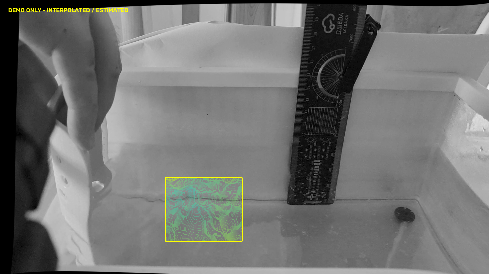
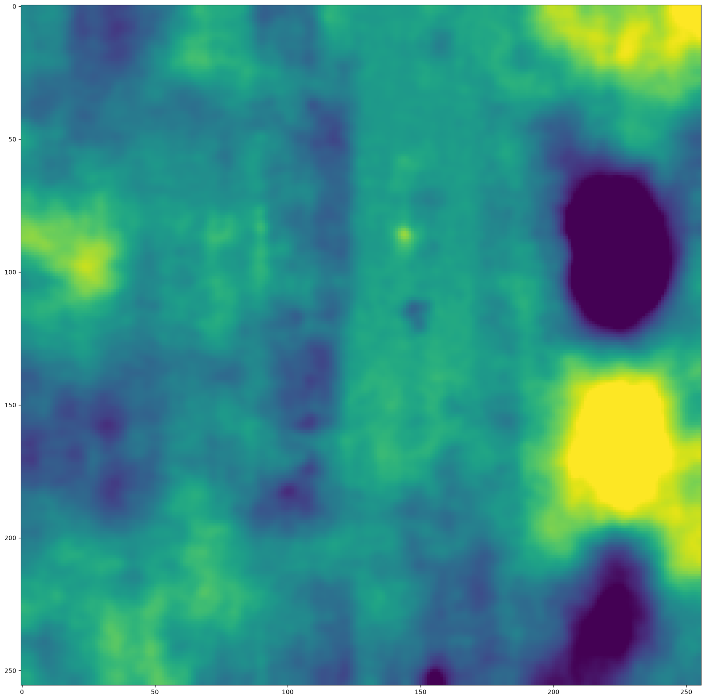

# Vieira/WASS 端到端工程演示（Track B）

状态：`END_TO_END_DEMO_PASS`，范围仅为本次冻结的 HomeTank_004 五帧短序列。
所有高度均为 `DEMO_ONLY_MEASUREMENT_NOT_VALIDATED`。

**不是完整原始数据科学复现，也不是每个水面像素准确测量的验收。** 严格 Track A 的 `BLOCKED_AT_OFFICIAL_WASS_STEREO` 结论及报告保持不变。

## A—B：数据集与原始视频

首先检查 HomeTank_005：历史曾输出 74,164 / 98,438 / 117,450 点，但对应成功程序包含诊断修改版 WASS，不能据此保证未修改官方程序成功。新同步、新内参和官方 autocalibrate 尝试仍受不可信几何阻塞。一次 LoFTR 预训练匹配 + OpenCV 几何恢复及有限官方配置尝试，也未获得完整官方 stereo 成功。因此换到 HomeTank_004，不再继续无边界调参。HomeTank_006 未作为最终样例：原始棋盘/可用几何风险在严格轨道审计中已记录，本轮没有再投入新的标定实验。

最终原始 LEFT：`D:\research\stereo-wave-height\experiments\real_video\HomeTank_004\videos\wave\wave_cam0_iQOO_Neo5S.mp4`。
RIGHT：同目录 `wave_cam1_iQOO_Z10_TurboPlus.mp4`。
视频 SHA256、帧时间和音频工具信息见 [sync_metadata.json](presentation_assets/vieira2025_end_to_end_demo/sync_metadata.json)。

## C：重新同步

按 wass_lowcost TLCC 方法：FFmpeg 提取 48 kHz 音轨，101 阶系数的 1000 Hz 高通 FIR，Praat 互相关及 Sinc70 峰值定位。没有读取旧同步结果。

右时间 − 左时间 = −0.0750700163 s；在名义 60 fps 下约 −4.5042 帧。左右配对通过容器时间戳重新抽帧，而不是宣称整数帧完全同步；音频同步也未独立证明曝光同步。LEFT 20.0、20.1、20.2、20.3、20.4 s，RIGHT 分别加上述时差，输出采样 10 Hz。

## D—G：标定、外参与方法边界

最终采用 **Level 1 DEMO_FALLBACK_CALIBRATION**：
`D:\stereo-wave-height-runs\HomeTank_004\wave-reconstruction-pipeline-20260824\wass_workspace\config`。
来自同一原始视频的历史波浪重建流程。对应历史提交/报告可从该实验命名及仓库历史追踪；本轮起点为 `a7e063be090b8f1780fcc83786c5cd60a76f4ae9`，文件级来源和 SHA256 见 manifest。内参和外参均非本轮从原始棋盘重新科学确认，物理精度未验证。

本次真正执行 prepare → match → autocalibrate。autocalibrate 返回 0，但 T 方向约 `[0.03924421, 0.93644821, −0.34860385]`，未作为最终重建几何。其外参保留为各 workspace 的 `attempted_autocal_ext_*.xml`；明确恢复来源配置的 R/T 后执行 stereo。没有人工改 Ty、交换分量或伪造外参。

长度尺度使用来源配置 baseline = 0.06868471158474378 m；其准确性未重新物理验证。使用未修改的官方 WASS `1.11_heads/master-0-g6b82aeb`，OpenCV 4.6。仅启用官方已有 `USE_CUSTOM_STEREORECTIFY`、固定 seed 和官方保存选项，没有改匹配、三角化或平面算法。

后处理为官方 wassgridsurface 0.11.4、wassncplot 2.5.3。薄 adapter 仅负责命令、日志、路径、统计和展示区域；LoFTR 只用于失败的 005 分支，不在最终 004 数值链中。

## H：重现入口与主要命令

在仓库根目录运行：

```powershell
powershell -ExecutionPolicy Bypass -File scripts/run_vieira_demo.ps1
# 从原始视频重新执行，输出到新的时间戳目录：
powershell -ExecutionPolicy Bypass -File scripts/run_vieira_demo.ps1 -Rebuild
```

依赖本机 FFmpeg、Praat、D:\wass\dist\bin 和官方 Python 环境；不是便携安装包。完整参数和每条实际命令在外部产物 `chain/logs` 及 `chain_summary.json`，可审计，不是历史截图拼接。

主要命令形式如下（WD 为新 workspace，CFG 为已记录来源配置）：

```text
wass_prepare.exe --workdir WD --calibdir CFG --c0 LEFT.png --c1 RIGHT.png
wass_match.exe CFG/matcher_config.txt WD
wass_autocalibrate.exe workspaces.txt
wass_stereo.exe official_stereo_config.txt WD
wassgridsurface.exe --action setup workspaces gridding --gridconfig gridconfig.txt --baseline 0.06868471158474378 --fps 10 --stereo_image_idx 0
wassgridsurface.exe --action grid workspaces gridding --gridsetup gridding/config.mat --num_frames 5 --parallel 1 --stereo_image_idx 0
wassncplot.exe gridding/gridded.nc wassncplot -f 0 -l 5 --savexyz --save-img --no-textoverlay --pxscale 1
```

官方 ncplot 的 `-l` 为排他上界，五帧需设 5。setup 读取这五个新平面，使用公共中位平面；官方 mesh decoder/alignment 的物理 XY 范围决定 256×256 正方形网格，不使用历史 gridded.nc/config.mat。

## I：本轮新结果

prepare 5/5、match 5/5、stereo 5/5；新 stereo 单帧约 1.39–1.58 s（不含 match/prepare），官方 setup 5.49 s、grid 16.96 s。新点总数 681,678，均 finite 且正投影深度。

| LEFT 时间/s | 新 XYZ 数 | source 占网格/% | 内凸包插值/% | 外推/% | 全网格高度范围/mm |
| --- | ---: | ---: | ---: | ---: | --- |
| 20.0 | 133419 | 19.34 | 28.97 | 51.69 | −102.27～59.56 |
| 20.1 | 142129 | 20.55 | 16.85 | 62.60 | −30.31～9.86 |
| 20.2 | 134047 | 18.93 | 13.99 | 67.08 | −22.25～13.80 |
| 20.3 | 136605 | 20.46 | 19.14 | 60.40 | −87.91～58.44 |
| 20.4 | 135478 | 19.54 | 19.51 | 60.95 | −85.26～29.34 |

source 比例是新点投到网格的占格率，**不是整个图像的测量率，也不是确认过的水面覆盖率**。凸包分类仅说明几何位置，不是置信度证明；边界外仍有 DCT 数值不等于有观测支撑。五帧共 327,680 格 finite，不能称 100% 直接测量。

输出包含新 `mesh_cam.xyzC`、官方 `mesh.ply/mesh_full.ply`、plane、NetCDF、五份 savexyz MAT。PLY 的 mesh 命名沿用官方，不额外宣称它一定是有面片拓扑的闭合网格。



原始官方全幅 overlay 也保存。它延伸到非水面，不能整体当作水面成果。上图仅在去畸变计算 cam0 坐标 `[650,700]—[950,950]` 的中央水面演示窗口显示原官方网格，其余显示原图。此为 **展示遮罩**，没有改变任何高度或重算曲面；不是覆盖大部分水面或任意用户 ROI 的产品验收。



高度网格含外推，某些帧边缘范围偏大，未证实其等于真实波高。详见 [output_audit.json](presentation_assets/vieira2025_end_to_end_demo/output_audit.json)。至少一个官方像素 XYZ 的回投影闭环已核验，误差约千分之一像素；这是坐标映射一致性，不是物理测量误差。查询数值由一键入口显示。

## J—M：交接与诚实结论

冻结完整产物：`D:\stereo-wave-height-runs\vieira2025-end-to-end-demo-20260916\golden_004_demo`。
Git 保存小图、配置、日志索引、hash manifest、测试及薄 launcher；大 workspace/MAT 在上述目录，**不宣称 GitHub 已备份大文件**。复算依赖原始视频和本地工具，完整文件校验清单见 manifest。

可以宣称：采用真实视频、可追溯标定 fallback，已跑通官方 WASS 重建、公共平面、官方网格、overlay 和像素高度查询的五帧端到端工程样例。

不能宣称：完整 Vieira 2025 原始数据科学复现、<1 cm、物理高度正确、人眼趋势已验证、跨帧公共坐标稳定性已独立验证、任意视频可用、所有水面像素均为直接观测。

下一步严格精度工作需要独立可靠原始标定、可信外参及长度尺度、曝光同步验证、水面成像对应验证、独立物理高度对照；应先排除非水面匹配，再评价跨帧漂移，而不是调 offset/scale/clip 让结果好看。本轮没有改 GUI、启用 MLS/RBF 或人为参考相减。

已有测试：476 passed、1 skipped，4 subtests passed；中文 TEMP 导致 NetCDF Windows 权限问题后，以独立 ASCII 测试临时目录完成全套。新增坐标变换针对性测试，保留严格轨道。最终检查另记录于 manifest。

资料依据：[Vieira 2025](https://doi.org/10.1016/j.coastaleng.2024.104694)、[官方 WASS 快速指南](https://www.dais.unive.it/wass/WASS_quickstart_guide.pdf)、[官方 WASS 源码](https://github.com/fbergama/wass)、[官方 wassncplot](https://sites.google.com/unive.it/wass/software/wassncplot)、[LoFTR 官方实现](https://github.com/zju3dv/LoFTR)。
