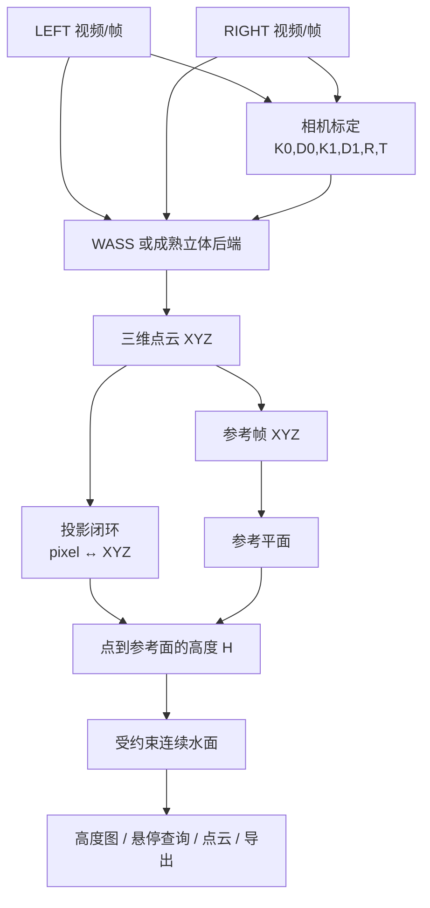

# 双目水面三维测量项目阶段性总览

> 从双目图像、相机标定、视差/深度计算、WASS 三维点云、像素—三维对应到水面高度计算

## 0. 一页看懂项目

本项目要解决的问题很直白：输入左右两段双目视频，用户选定需要测量的水面区域、一个参考水面和目标时刻，系统输出该时刻水面相对于参考面的三维点云、逐像素三维坐标和高度图。

可以把它理解成“让两台相机一起给水面量高低”。最终不是只给一个平均水位，而是希望给画面里每个水面像素一个高度 `H(u,v)`，并能显示颜色高度图、三维点云和导出数据。

项目已经建立的主链为：

```text
左右视频 → 同步帧 → 相机标定 → 极线校正 → 左右匹配
        → 视差/深度 → 三维点云 XYZ → 像素↔XYZ
        → 参考平面 → 相对高度 H → 连续水面模型
        → 高度图 / 点云 / 导出 / Windows 演示软件
```

已完成的是理论模型、合成数据闭环、OpenCV 标定流程、WASS 接入、真实手机视频的阶段性重建、像素—三维对应、参考面/高度模型、连续水面模型和 GUI 主流程。尚未完成的是：真实物理精度的独立验收、高比例直接双目观测覆盖、任意参考帧的稳定实时 WASS 重建，以及专业双目相机迁移。



整个项目后续所有工作，就是逐一建立、验证并连接这张图中的每一个箭头。

## 1. 项目怎样一步一步走到今天

| 阶段 | 做了什么 | 为什么要做下一步 |
|---|---|---|
| 双目数学与合成仿真 | 建立投影、视差、深度、参考面和波浪真值 | 先在“答案已知”的环境检查公式和坐标链 |
| OpenCV 标定 | 求得相机内参和左右外参 | 深度公式需要真实焦距、畸变和基线 |
| WASS 接入 | 将标定与左右图像送入 WASS，读取 XYZ | 需要从真实图像得到三维观测点 |
| HomeTank_004 | 首次真实手机视频验证 | 真实数据暴露标定残差、匹配稀疏和跨帧漂移 |
| 诊断实验 | 检查视差范围、支持漏斗、平面与坐标 | 不能在不知道原因时盲调匹配器 |
| split calibration 与 HomeTank_005 | 左右单目标定分开使用有效帧，只用重叠帧求 R/T | 让标定方法适应真实拍摄覆盖，而非丢弃大量单侧有效信息 |
| 像素↔XYZ、参考面和高度 | 将点云重新投影到主画面，用平面距离定义高度 | 点云的相机深度不等于水面相对高度 |
| 连续水面与 GUI | 处理直接观测稀疏、提供按需单帧展示 | 让结果能被用户理解和查询 |

下面按知识逻辑说明每一步，而不是按代码提交顺序罗列。

## 2. 从一张二维照片到三维世界

### 2.1 问题：一个像素为什么不够

普通相机拍到的是二维位置 `(u,v)`：横向第几个像素、纵向第几个像素。可是水面测量真正需要的是空间位置 `(X,Y,Z)`，其中 `Z` 表示离相机多远。

如果只有一台相机，一个像素只能确定一条“从镜头射出去的方向线”，却不能确定水点在线上的哪一个位置。就像看到天上的飞机，只知道它在视野的哪个方向，仍不知道它离你多远。

双目相机相当于人的左右眼。同一个近处物体在两眼中位置差大，远处物体位置差小。这个位置差给了我们距离信息。

### 2.2 模型一：针孔相机

**要解决什么：** 解释一个真实三维点为什么会落到图像中的某个像素。

**公式：**

`s [u v 1]^T = K [R|t] [X Y Z 1]^T`

其中：

- `(u,v)`：照片里的像素坐标；
- `(X,Y,Z)`：空间里的点，单位通常为 m；
- `s`：投影时出现的比例因子；
- `K`：相机内参，描述镜头和传感器；
- `R,t`：相机相对世界坐标的朝向与位置。

内参矩阵写作：

```text
K = [ fx   0  cx ]
    [  0  fy  cy ]
    [  0   0   1 ]
```

`fx,fy` 是以像素为单位的焦距，可以理解为相机把世界“放大”到图像上的尺度；`cx,cy` 是光轴穿过图像的位置。简化后，三维点投影到像素的公式是：

`u = fx·X/Z + cx`

`v = fy·Y/Z + cy`

**项目里怎么用：** 标定时求 `K`；像素—XYZ 模块用这组公式把 WASS 点云投影回 canonical RIGHT/cam1 主画面，建立 `(X,Y,Z) ↔ (u,v)`。

### 2.3 模型二：镜头畸变

真实镜头并不是完美针孔。镜头边缘常发生“桶形”或“枕形”弯曲；镜头与传感器轻微不平行也会引入偏移。OpenCV 用 `k1,k2,k3` 描述径向畸变，用 `p1,p2` 描述切向畸变。

一句话理解：不先把镜头的弯曲算进去，直线会弯、左右像素对应关系会错，后面的深度就没有可靠几何基础。因此标定结果必须包括 `K0,D0,K1,D1,R,T`，不能拿人工测得的基线长度替代全部标定。

## 3. 双目最核心的数学：视差怎样变成深度

### 3.1 模型三：视差

对校正后的左右图，同一个水点在左图横坐标为 `uL`，在右图为 `uR`：

`d = uL - uR`

这个 `d` 叫视差，单位是 pixel。它不是“图像看起来有多像”，而是同一物理点在两张图中横向错开了多少。

### 3.2 模型四：视差—深度关系

设两相机光心距离为基线 `B`，校正后的像素焦距为 `f`，相似三角形给出：

`Z = fB / d`

变量含义：

- `Z`：点的深度；
- `f`：像素焦距；
- `B`：双目基线，单位 m；
- `d`：视差，单位 pixel。

这条公式其实是在说：

> 视差大，物体近；视差小，物体远。

同一距离下，基线更大或焦距更大，图像中的视差更明显，所以深度更容易区分。这正是项目建立 `src/stereo_analysis/` 参数设计工具的原因：未来专业相机的基线、工作距离、焦距和可接受视差范围都应先用这个公式计算。

### 3.3 模型五：深度误差为什么会放大

对 `Z=fB/d` 做近似微分：

`|δZ| ≈ Z²/(fB) · |δd|`

这条公式解释了真实实验中的很多困难：同样错 1 个像素，目标越远，深度误差按 `Z²` 增大；基线越短或焦距越小，误差也越大。因此标定误差、左右匹配误差、反光、低纹理、相机抖动都会传递到最终高度。

例如 `Z=2 m, f=3000 px, B=0.16 m, δd=0.1 px` 时，估算 `δZ≈0.83 mm`。这个例子只说明理想几何的敏感性，不是对真实手机视频精度的承诺。

### 3.4 模型六：三角化

左图中的一个像素形成一条空间射线，右图对应像素形成另一条空间射线。两条射线共同约束一个空间点：

`P = (X,Y,Z)`

WASS 的职责就是在左右真实图像中寻找对应点、估计视差，并依据标定几何完成这种三维恢复。OpenCV 标定负责回答“两台相机如何摆放”，WASS 负责回答“这两个图像像素是不是同一个物理点”。

## 4. 为什么先在合成世界验证

真实视频里同时有标定、同步、曝光、纹理、反光、匹配、坐标变换等问题。如果一开始就拿真实水面测试，失败时无法知道是哪一层错了。

因此项目先建立了虚拟双目相机、静水面、固定高度面和正弦规则波。合成数据有已知真值 `H_true`，可以逐项检查：投影是否正确、`Z=fB/d` 是否成立、三维坐标方向是否闭合、参考面差分是否得到预期高度。

| 合成实验 | 为什么做 | 已记录结果 | 说明 |
|---|---|---|---|
| 针孔投影与反投影 | 检查像素/空间坐标转换 | 单元测试与仿真几何闭环通过 | 验证公式和坐标方向 |
| 静水 Case 0 | 检查参考面与零高度 | WASS→网格→参考面链闭环 | 不把自身均值的零误差当真实精度 |
| 固定高度 Case 1 | 检查非零高度的符号和尺度 | +10 mm 理想场景在冻结参数下 RMSE 约 1.03 mm | 只代表理想合成条件 |
| 规则正弦波 | 检查幅值、波长、频率和相位链 | 有多组受控仿真记录 | 说明规则几何下可恢复时空形态 |
| 支持掩码 | 检查无原始观测处如何处理 | 早期保持 NaN，后续单独评估补全 | 不把无证据像素直接写成观测值 |

主要证据见 [Case 1 仿真结果](docs/validation/case1_constant_height.md)、[采购前仿真矩阵](docs/validation/prepurchase_validation_matrix.md)。`1.03 mm` 是合成理想条件下的算法闭环结果，绝不能写成真实水面已经达到 1 mm 精度。

## 5. HomeTank_004：真实视频第一次暴露主要问题

理想数据通过后，项目进入 HomeTank_004 手机双目真实视频。这里最重要的收获不是“第一次就测准了水面”，而是用真实数据找到下一步应该改哪里。

### 5.1 标定结果说明了什么

| 指标 | HomeTank_004 记录值 |
|---|---:|
| LEFT mono RMS | 4.381 px |
| RIGHT mono RMS | 4.525 px |
| Stereo RMS | 7.922 px |
| Symmetric epipolar RMS | 9.508 px |
| Rectified vertical RMS | 21.123 px |
| Calibrated baseline | 68.685 mm |
| 人工测量 baseline | 约 70 mm |

数据来源：[calibration_metrics.json](experiments/real_video/HomeTank_004/calibration_metrics.json)、[calibration_spatial_salvage.md](experiments/real_video/HomeTank_004/calibration_spatial_salvage.md)。

基线长度接近 70 mm 只说明 `||T||` 接近人工测量长度；**不等于** `K/D/R/T` 的整体几何已经正确。特别是校正后仍有约 21 px 的纵向残差，说明理论上应该同一水平线的点，实际上仍相差很多像素。也就是说，“基线长度对了，不等于左右相机方向、焦距和畸变都对。”

### 5.2 WASS 重建漏斗

HomeTank_004 的一次受控诊断中，点数经历如下漏斗：

| 阶段 | 数量 | 含义 |
|---|---:|---|
| Common rectified FOV | 2,073,600 px | 理论可见的公共区域 |
| Valid triangulated depth | 229,164 | 约 11.05% 获得有效三角化深度 |
| Largest Z-gap component | 135,205 | 连通性筛选后保留的主区域 |
| Final XYZ | 135,205 | 约 6.52% 成为最终点云 |

数据来源：[wass_support_extent_diagnosis.md](experiments/real_video/HomeTank_004/wass_support_extent_diagnosis.md)。

这说明大量像素并不是“后处理弄丢了”，而是在左右匹配、三角化和连通性判断中已经没有足够证据。真实水面对 WASS 困难：纹理弱、镜面反光、高光随视角变化、局部重复、左右亮度不同，都会让“同一个点”难以可靠确认。

### 5.3 不能只看单帧平面

HomeTank_004 的单帧水面平面 RMS 约 2.0–2.25 mm，但跨静水帧诊断出现约 97.2 mm 的平均 Z 漂移和最大约 12.17° 的法向变化。结论是：

> 一帧内部看起来像平面，不等于多帧位于同一个稳定的三维坐标系。

因此不应把“某一帧平面 RMS 小”直接包装成真实波高精度。证据见 [static_frame_geometry_diagnostic.md](experiments/real_video/HomeTank_004/static_frame_geometry_diagnostic.md) 与 [static_validation_summary.md](experiments/real_video/HomeTank_004/static_validation_summary.md)。

### 5.4 用实验排除错误方向

曾怀疑默认视差搜索范围太小，于是仅扩大 `numDisparities` 到更大范围。1280/2560 的隔离实验没有恢复稳定支持，反而引入更多错误匹配。因此“只要扩大视差范围就能解决”被排除，下一步应回到标定质量和图像可观测性，而不是继续盲调 WASS。记录见 [wass_disparity_range_audit.md](experiments/real_video/HomeTank_004/wass_disparity_range_audit.md)。

又尝试从旧标定视频中挑选更多帧进行 salvage。结果候选帧的空间覆盖没有真正扩展，held-out 几何并未变好。这说明原始视频本身没有提供足够的新几何信息，不能靠“多挑几帧”补出来。

## 6. 为什么重构标定流程，并重新采集 HomeTank_005

早期流程隐含一个苛刻要求：只有 LEFT 和 RIGHT 都看见完整棋盘时，该帧才有用。真实拍摄中这会浪费大量信息：左相机清晰看到棋盘而右相机只看到一部分时，左相机的有效单目标定信息也被丢弃了。

新的 split calibration 逻辑是：

```text
LEFT 完整棋盘帧  → calibrateCamera → K_L, D_L
RIGHT 完整棋盘帧 → calibrateCamera → K_R, D_R
左右共同棋盘帧   + 固定 K/D → stereoCalibrate(CALIB_FIX_INTRINSIC) → R,T
```

一句话理解：**不要因为另一台相机没看全，就把这一台相机已经看清的有效信息也丢掉。**

### 6.1 grouped cross-validation：不能让模型“偷看答案”

视频相邻帧中的棋盘姿态往往几乎相同。如果把一组近重复姿态的一些帧放进训练、另一些放进验证，验证集看起来像新题，实际却和训练题几乎一样，结果会虚高。

所以项目把近似姿态放进同一个 group；同一个 group 不允许同时出现在训练和验证。HomeTank_005 使用 17 个独立姿态组、5-fold grouped cross-validation。通俗说，就是验证时必须让模型面对真正没有见过的棋盘姿态。

### 6.2 4 系数和 5 系数畸变模型

`OPENCV_4_COEFFICIENT` 使用 `k1,k2,p1,p2`；`OPENCV_5_COEFFICIENT` 额外使用 `k3`。参数更多不自动更好：数据无法稳定约束时，高阶参数可能只是“把训练误差压低”，却让新姿态更差。因此比较时不仅看训练 RMS，还看 held-out rectification、参数稳定性和畸变的物理合理性。

### 6.3 HomeTank_005 的改善与保留的限制

| 指标 | HomeTank_004 | HomeTank_005 |
|---|---:|---:|
| LEFT mono RMS | 4.381 px | 3.693 px |
| RIGHT mono RMS | 4.525 px | 3.287 px |
| Stereo RMS | 7.922 px | 3.694 px |
| Epipolar RMS | 9.508 px | 3.708 px |
| Full-sample vertical RMS | 21.123 px | 13.045 px |
| Baseline | 68.685 mm | 93.345 mm |

数据来源：[HomeTank_005 adaptive_calibration.yaml](experiments/real_video/HomeTank_005/calibration_adaptive/adaptive_calibration.yaml)、[PROJECT_OVERVIEW.md](PROJECT_OVERVIEW.md)。

这些数字说明平均几何误差确实下降；但 grouped-CV 最差折仍达到 18.635 px，焦距、畸变和基线在折间的稳定性仍不充分。因此 HomeTank_005 被记录为 `HOMETANK005_CALIBRATION_MODEL_LIMIT_REACHED`：它是一次明显改进的阶段标定，不是最终高精度标定完成的证明。

## 7. WASS 怎样得到真实 XYZ

WASS 不是“直接算波高”的黑盒。它接收左右图像和相机几何，主要经历：

```text
prepare → match → stereo → triangulation → XYZ point cloud
```

其中 match/stereo 找左右对应，triangulation 将对应像素和标定几何变为三维点集 `{Pi}`，每个 `Pi=(Xi,Yi,Zi)`。项目没有重写 WASS 的匹配、自动标定或三角化算法；工作重点是正确组织输入、记录输出、验证坐标/尺度、分析支持范围。

真实运行已得到数万至十万量级的有限 XYZ 点。例如 HomeTank_005 的冻结演示参考 artifact 记录 `101,548` 个支持/XYZ 点；不同目标帧和 ROI 的点数不同，不能把一个点数当作通用成功率。证据：[demo_reference_artifact.yaml](experiments/real_video/HomeTank_005/demo_reference_artifact.yaml)。

## 8. XYZ 怎样回到图像像素

WASS 给出点云，但 GUI 需要回答：“我鼠标指向画面的这个像素，它对应哪个三维水点？”因此项目建立 authoritative pixel domain：canonical RIGHT/cam1。

对每个三维点使用投影公式：

`u=fx·X/Z+cx`

`v=fy·Y/Z+cy`

把点投回右相机画面，建立 `(u,v) ↔ (X,Y,Z)`。项目曾出现“XYZ 很多但 OBSERVED=0”的现象，最终定位为读取 `mesh_cam.xyzC` 时 row-major inverse rotation 被重复转置，导致点云投影回错误方向。修复后，真实 XYZ 才能回到正确像素位置。这是一个重要工程教训：点云数量多不等于像素映射一定正确，必须做投影闭环检查。

## 9. 从 XYZ 到参考面和水面高度

### 9.1 为什么相机 Z 不是波高

相机可以倾斜拍摄水面，画面中的 `Z` 只是“沿相机光轴的深度”。同一个水平水面在不同像素的相机 Z 可以不同。因此不能把相机 `Z` 直接叫做波高。

### 9.2 模型七：参考平面

参考水面写为：

`aX+bY+cZ+d=0`

它是一张放在三维空间里的平面。项目可由静水帧的三维点拟合它，或使用冻结的真实成功参考 artifact。参考帧的作用是定义“零高度在哪里”。

### 9.3 模型八：相对水面高度

空间点 `P=(X,Y,Z)` 到参考平面的有符号正交距离为：

`H(P)=(aX+bY+cZ+d)/sqrt(a²+b²+c²)`

- `H>0`：点在参考面法向的一侧；
- `H<0`：点在另一侧；
- `H=0`：点正好在参考面上。

这才是项目最终展示的相对水面高度。它有明确几何依据：计算的是点到平面的垂直距离，不是任意取一个相机坐标分量。

参考流程从固定静水视频演化为用户选择参考帧：用户暂停 → 重建参考帧 → 拟合参考平面 → 重建目标帧 → 计算点到平面距离。当前任意参考帧的 native WASS runtime 仍有稳定性问题；演示阶段可复用此前真实 WASS 成功生成的 precomputed reference artifact。它不是伪造平面，但也不等同于“任意现场参考帧都已稳定重建”。

## 10. 从稀疏观测到连续水面

### 10.1 为什么不能说所有像素都是直接双目测量

只有左右匹配成功并通过几何检查的像素，才有直接的 stereo XYZ。这些像素标记为 `OBSERVED`。水面反光或无纹理处没有可靠对应，直接高度应为 NaN/`UNSUPPORTED`，不能凭空写数。

但是演示和后续工程应用需要连续高度场，所以项目研究了两类有明确数学约束的补全：局部 MLS 与受约束规则网格曲面。估算像素必须和直接观测区分，不能包装为原始 WASS 实测。

### 10.2 一个失败实验：无约束 global RBF

曾尝试以全局 RBF 把稀疏高度点补成整片水面。某次输出范围达到 `-103.177 mm` 到 `+508.741 mm`，明显远超局部观测趋势，属于无约束外推爆炸。

这个失败很有价值：它排除了“只要用一个更平滑的插值函数就能自然补满水面”的想法。证据：[DEMO_READINESS_REPORT.md](experiments/real_video/HomeTank_005/DEMO_READINESS_REPORT.md)。

### 10.3 模型九：受约束连续水面

现有模型将高度写成：

`H(x,y)=H_base(x,y)+δH(x,y)`

`H_base` 可取平面或二次趋势；`δH` 是局部平滑残差。规则网格上的核心目标函数为：

`min_h Σ_i wi(hi-Hi_obs)^2 + λ1||∇h||² + λ2||Δh||²`

三项分别表示：

1. **数据项**：拟合结果不能离真实观测 `Hi_obs` 太远；
2. **梯度项**：相邻水面不要无依据地突然跳变；
3. **曲率项**：水面不要出现孤立尖峰或异常大弯曲。

`H_base+δH` 的设计使远离观测支持点时残差逐渐回到稳定趋势，而不会像旧 RBF 那样无边界爆炸。模型还用有限性、稳健范围、梯度和曲率守卫拒绝异常输出。一次内部空间 hold-out 记录 MAE 4.329 mm、RMSE 5.234 mm、P95 10.249 mm；它验证的是“能否重现已有 WASS 曲面”，不是独立物理波高精度。证据：[DEMO_READINESS_REPORT.md](experiments/real_video/HomeTank_005/DEMO_READINESS_REPORT.md)。

## 11. Windows 演示软件与当前交互路线

软件产品路线是**视频输入、按需单帧解算**，不是每秒处理所有帧的实时三维视频。原因很简单：WASS 单帧计算重，用户通常关心某一个时刻，因此更合理的交互是播放视频 → 暂停 → 解算当前同步帧。

演示主流程为：

```text
加载标定 → 加载 LEFT/RIGHT 视频 → canonical RIGHT/cam1 主画面
→ 人工框选水面 ROI → 设置参考面 → 选择目标帧
→ 单帧三维重建 → XYZ / H → 高度覆盖图、悬停查询、点云、导出
```

曾尝试依据标定自动计算双目 common FOV，理论目的是只让用户选左右真正重叠的区域、减少无效计算。真实 GUI 中发现 rectified、canonical 与 crop 坐标域容易混用，导致实际裁剪错误。因此当前演示路线采用更稳定、可解释的工程简化：RIGHT/cam1 作为唯一主交互画面，由用户人工框选水面 ROI。自动 common FOV 保留为后续研究，不再作为当前演示的前置条件。

Windows 程序入口为 `dist/StereoWaveHeightDemo/StereoWaveHeightDemo.exe`；打包后的运行环境兼容性仍需继续稳定化，不能据此宣称 GUI 已完成最终工程验收。

## 12. 关键实验总表

| 实验 | 为什么做 | 做了什么 | 关键结果 | 结论/下一步 |
|---|---|---|---|---|
| Synthetic 几何闭环 | 防止坐标/公式错误 | 虚拟相机投影、深度和反投影 | 理想模型链通过 | 再进入真实视频 |
| Synthetic +10 mm | 检查非零高度 | 固定高度面、共用参考坐标 | RMSE 约 1.03 mm | 仅证明理想闭环 |
| HomeTank_004 标定 | 首次真实几何 | OpenCV mono/stereo | stereo RMS 7.922 px | 几何残差偏大 |
| 004 support 漏斗 | 找 WASS 点为何少 | 统计公共区、三角化、连通分量 | 2.07M→229k→135k | 匹配/支持是瓶颈 |
| 004 跨帧静水 | 检查稳定性 | 比较三帧平面 | Z 漂移约 97.2 mm | 单帧 RMS 不能代表稳定性 |
| disparity range | 检查搜索上限 | 扩大范围隔离测试 | 未恢复稳定支持 | 不把主要问题归咎于范围 |
| 004 salvage | 检查多选帧能否补救 | candidate pool/greedy 选择 | coverage 不足未改善 | 原始标定可观测性不足 |
| split calibration | 利用单侧有效棋盘 | 左右 mono 与 bilateral 外参分开 | 流程已建立 | 用于新采集 |
| HomeTank_005 grouped CV | 防止验证虚高 | 17 groups、5 folds | 平均误差下降，最差折仍高 | 参数稳定性仍需研究 |
| 4/5 畸变模型 | 防止过拟合 | 比较 held-out 与稳定性 | 参数多不自动更好 | 采用数据能约束的模型 |
| 真实 WASS XYZ | 验证真实三维输出 | 固定标定与真实视频 | 单帧可得数万—十万点 | 直接支持仍稀疏 |
| XYZ→pixel 闭环 | 让 GUI 可查询 | 三维点重投影到 cam1 | 修复重复转置问题 | 建立像素—三维对应 |
| global RBF | 尝试稀疏补全 | 无约束全局外推 | -103 至 +509 mm 爆炸 | 拒绝该路线 |
| regularized surface | 稳定连续高度场 | 数据项+平滑/曲率约束 | 有界内部 hold-out | 作为估算模型，非物理真值 |
| automatic common FOV | 自动限制 ROI | GUI 坐标域裁剪实验 | crop 不稳定 | 当前采用人工 ROI |

## 13. 每次修改都来自一个可检验的假设

| 当时怀疑什么 | 怎样验证 | 得到什么 | 因此怎么做 |
|---|---|---|---|
| 搜索视差范围不够？ | 单独扩大 disparity range | 支持未明显恢复，错误匹配增加 | 不继续靠扩大范围解决 |
| 基线接近手工值就代表标定正确？ | 查看 rectification vertical residual | 仍约 21 px | 把几何整体质量与基线长度分开判断 |
| 多挑旧棋盘帧能救标定？ | greedy/candidate salvage | 空间覆盖未真正扩大 | 重新设计采集与 split calibration |
| WASS 是唯一问题？ | 标定、校正、支持漏斗联合审计 | 真实几何先不稳定 | 先回到标定流程 |
| RBF 可自然补齐水面？ | 全局 RBF 实验 | 出现 +508.741 mm 外推爆炸 | 改用受约束正则化模型 |
| XYZ 多就代表像素映射正确？ | 投影闭环检查 | 曾出现 XYZ 多但 OBSERVED=0 | 修复 row-major rotation 转置 |
| 自动 common FOV 能直接用于 GUI？ | 真实交互裁剪测试 | 坐标域混用导致错误 crop | 当前改为 RIGHT/cam1+人工 ROI |

这张表体现了项目不是围绕 WASS 或 GUI 随机试错：每次路线变化都来自一次能够证伪或支持的实验。

## 14. 当前成果、局限与下一步

### 14.1 成熟度表

| 模块 | 状态 | 已有成果 |
|---|---|---|
| 双目理论 | 已完成 | 投影、视差、深度、误差、平面高度公式 |
| Synthetic | 已完成 | 静水、固定高度、规则波闭环 |
| OpenCV calibration | Pipeline 已完成 | mono/stereo、畸变模型、QA |
| split calibration / grouped CV | 已完成 | 单侧信息复用、17 组五折验证 |
| Calibration stability | 仍需提高 | 005 平均误差下降但稳定性不足 |
| WASS | 已接入 | 真实输入与 XYZ 点云输出 |
| pixel↔XYZ | 已实现 | canonical cam1 重投影闭环 |
| Reference / height | 数学模型完成 | 平面和有符号高度 H |
| 连续水面 | 阶段完成 | MLS、规则网格正则化与防爆守卫 |
| GUI / EXE | 主要功能已完成 | 视频、ROI、单帧、覆盖图、点云、导出 |
| 物理准确度 | 未完成 | 已有独立验证接口，未完成最终验收 |
| 专业双目相机 | 后续 | 已有参数设计工具和通用接口 |

### 14.2 当前局限

1. 真实标定的参数稳定性仍不足；
2. WASS 直接双目观测覆盖偏低，尤其在低纹理/反光水面；
3. 任意参考帧的 native WASS realtime solve 尚未稳定；
4. 自动 common FOV 在当前 GUI 坐标域中暂不稳定；
5. 全像素高度场含有模型补全成分，不能称为全部直接 stereo 实测；
6. 真实物理波高尚未完成独立 ground-truth 精度验收；
7. 当前手机是验证平台，专业同步工业双目迁移尚未完成。

### 14.3 下一步由当前问题自然推出

| 当前现象 | 下一步 |
|---|---|
| 标定折间参数不稳定 | 改善棋盘可观测性、姿态覆盖和 stability-aware calibration |
| 直接匹配覆盖低 | 研究低纹理/光度鲁棒性与专业相机采集条件 |
| reference runtime 不稳定 | 隔离 native WASS 运行环境并恢复任意参考帧实时重建 |
| 物理准确度未知 | 使用独立下游 ground truth 做误差评价 |
| 手机只适合验证 | 迁移到同步专业双目相机 |

外部标尺或物理靶标只能用于最终独立验证，不可反过来参与 calibration、WASS、参考面拟合或高度拟合；否则就变成“拿答案调模型”，不再是独立验证。

## 15. 项目一环扣一环的结论

1. 双目数学说明深度依赖 `f/B/d`，所以必须先标定相机几何；
2. Synthetic 证明投影、三角化、参考面和高度差分在已知真值下能闭环；
3. HomeTank_004 真实结果暴露出高 rectification residual 和低 WASS 支持，因此不能只调 matcher；
4. 004 的 salvage 说明旧棋盘视频的空间可观测性不足，因此重构 split calibration 并重新采集 005；
5. 005 的平均指标明显改善，但 grouped-CV 稳定性仍不足，所以不宣称最终高精度标定完成；
6. WASS 已给出真实 XYZ，随后必须建立 XYZ→pixel 投影闭环，GUI 才能查询画面位置；
7. XYZ 的相机深度不是波高，因此建立参考平面和点到平面的 `H`；
8. 真实水面直接 XYZ 稀疏，因此研究补全；
9. RBF 发散后改为带观测约束、梯度和曲率惩罚的规则网格曲面；
10. 自动 common FOV 在真实 GUI 中不稳定后，当前工程路线改为 RIGHT/cam1 主画面和人工 ROI。

项目已经完成从双目图像到相对水面高度、连续高度场和软件展示的完整理论与软件链路。下一阶段的重点不是再堆功能，而是提高真实标定稳定性、直接双目支持覆盖和独立物理准确度。

## 附录 A：核心公式总表

| 公式 | 在项目中做什么 | 一句话理解 |
|---|---|---|
| `s p=K[R|t]P` | 针孔投影 | 三维点为什么落在这个像素 |
| `d=uL-uR` | 定义视差 | 左右照片中同一点横向错开多少 |
| `Z=fB/d` | 由视差得到深度 | 近处视差大，远处视差小 |
| `|δZ|≈Z²/(fB)|δd|` | 深度误差传播 | 远距离和匹配误差更危险 |
| `u=fxX/Z+cx, v=fyY/Z+cy` | XYZ 回投影 | 三维点怎样回到 GUI 像素 |
| `aX+bY+cZ+d=0` | 参考水面 | 在三维空间放一张零高度平面 |
| `H=(aX+bY+cZ+d)/sqrt(a²+b²+c²)` | 相对高度 | 当前点比参考面高或低多少 |
| `H=Hbase+δH` | 连续水面 | 稳定趋势加局部变化 |
| `Σwi(hi-Hi)^2+λ1||∇h||²+λ2||Δh||²` | 受约束补全 | 贴近观测，同时避免跳变和尖峰 |

## 附录 B：代码和实验在哪里

| 主题 | 路径 |
|---|---|
| 理论与合成仿真 | [src/simulation/](src/simulation/) |
| 相机标定 | [src/calibration/](src/calibration/) |
| 标定 GUI/workflow | [src/application/calibration_workflow.py](src/application/calibration_workflow.py) |
| 几何工具 | [src/geometry/](src/geometry/) |
| WASS/重建接口 | [src/reconstruction/](src/reconstruction/) |
| 双目参数设计 | [src/stereo_analysis/](src/stereo_analysis/) |
| 参考面 | [src/reference/](src/reference/) |
| 高度计算 | [src/height/](src/height/) |
| 水面补全 | [src/surface_completion/](src/surface_completion/) |
| GUI | [src/application/](src/application/) |
| 同步 | [src/synchronization/](src/synchronization/) |
| 验证 | [src/validation/](src/validation/) |
| 鲁棒性文档 | [docs/robustness/](docs/robustness/) |
| 真实实验 | [experiments/real_video/](experiments/real_video/) |
| 自动化测试 | [tests/](tests/) |
| 打包 | [packaging/](packaging/) |

