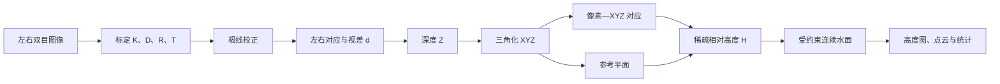

# 双目水面三维测量项目阶段性技术报告

## 1. 研究目标与完整数据流

本项目研究如何利用两台相机拍摄的水面图像，恢复水面的三维形态与相对高度。左、右相机在时刻 `t` 获得的图像分别记为

$$
I_L(u,v,t),\qquad I_R(u,v,t),
$$

最终希望得到右相机主画面内水面像素的相对高度场

$$
H(u,v,t).
$$

这不是由图像颜色直接“猜高度”，而是依次求解相机几何、左右对应关系、三维坐标和参考面距离。完整数据流如下。



其等价的文字链为：

```text
双目图像 → 相机参数 → 双目几何 → 极线约束 → 视差 → 深度
        → 三角化 XYZ → 像素—三维映射 → 参考平面
        → 有符号相对高度 → 稀疏高度 → 连续水面 → 展示结果
```

项目的全部工作，本质上是在依次求解这条链中的未知量，并用合成数据和真实视频检查每一级输出是否成立。当前已经建立完整数学与软件链；合成数据证明了理想条件下的闭环正确性，真实视频已经产生数万至十万量级的三维点并完成阶段性高度场计算，但尚不能宣称真实水面已达到毫米级测量精度。

## 2. 从三维空间到二维像素：相机成像模型

### 2.1 输入、未知量与针孔投影

本阶段的输入是空间点 `P_w=(X,Y,Z)^T`、相机姿态和镜头参数，输出是图像像素 `p=(u,v)^T`。针孔相机模型写为

$$
s\,(u,v,1)^T=K\,[R\mid t]\,(X,Y,Z,1)^T.
$$

其中

$$
K_{11}=f_x,\quad K_{22}=f_y,\quad
K_{13}=c_x,\quad K_{23}=c_y,\quad K_{33}=1,
$$

并且 `K` 的其余元素为 0。这个写法与常见的三行三列内参矩阵完全等价，但不依赖矩阵换行命令。

`R,t` 先把世界坐标点变换到相机坐标系，`K` 再把相机坐标投影到图像；`f_x,f_y` 是以像素为单位的焦距，`c_x,c_y` 是主点，`s` 是齐次尺度。若点已经位于相机坐标系中，公式展开为

$$
u=f_x\frac{X}{Z}+c_x,
\qquad
v=f_y\frac{Y}{Z}+c_y.
$$

这说明一台相机只能由 `(u,v)` 确定一条空间射线：式中仍有 `X,Y,Z` 三个未知量，单张图像不能唯一求出深度 `Z`。第二台相机提供另一条观测射线，使深度可解。

### 2.2 镜头畸变

真实镜头会使理想投影发生弯曲。归一化坐标记为 `(x,y)`，令

$$
r^2=x^2+y^2,
$$

径向畸变的主体为

$$
x_{radial}=x(1+k_1r^2+k_2r^4+k_3r^6),
$$

$$
y_{radial}=y(1+k_1r^2+k_2r^4+k_3r^6),
$$

切向畸变再由 `p_1,p_2` 修正。因此可用于重建的标定结果不只有焦距，还必须包含左右内参 `K_L,K_R`、畸变参数 `D_L,D_R` 和左右相对姿态 `R,T`。

### 2.3 本阶段怎样验证

项目首先用已知虚拟相机和已知三维点执行“投影—反投影”闭环；随后建立 OpenCV golden-path 数据，得到左右单目 RMS 0.1954/0.2070 px、双目 RMS 0.2168 px、极线 RMS 0.1769 px、校正后纵向 RMS 0.1707 px。它说明实现能够在受控数据上恢复一致的像素几何，因此可以进入真实相机标定；它不代表手机实拍也会自动达到同样误差。

## 3. 相机标定：求解双目系统的几何参数

### 3.1 棋盘提供的已知量

棋盘方格尺寸已知，因此第 `j` 个角点可写成棋盘坐标系中的平面点

$$
P_j=(X_j,Y_j,0)^T.
$$

第 `i` 帧中检测到的对应图像角点为

$$
p_{ij}=(u_{ij},v_{ij})^T.
$$

标定的输入是许多组 `P_j\leftrightarrow p_{ij}`，未知量是相机内参、畸变以及每一帧棋盘相对相机的姿态。

### 3.2 单目标定的优化模型

对左相机，需要求 `K_L,D_L` 和每个棋盘姿态 `R_{Li},t_{Li}`；右相机同理。模型用候选参数预测角点位置 `\hat p`，并最小化真实检测位置与预测位置的差：

$$
\min_{\theta}\sum_i\sum_j
\left\|p_{ij}-\hat p(K,D,R_i,t_i,P_j)\right\|^2.
$$

标定的本质，就是不断调整相机参数，使模型投影出来的棋盘角点尽可能接近实际检测角点。重投影均方根误差为

$$
RMS=\sqrt{\frac{1}{N}\sum_{n=1}^{N}\|p_n-\hat p_n\|^2},
$$

单位是 pixel。RMS 越小，表示这套参数对观测角点的平均解释误差越小，但它不能单独保证未见姿态或整幅画面都同样准确。

### 3.3 双目标定的 `R/T` 模型

同一空间点在左右相机坐标系中的关系为

$$
P_R=RP_L+T.
$$

`R` 是 LEFT 坐标系到 RIGHT 坐标系的相对旋转，`T` 是相对平移。双目基线由

$$
B=\|T\|
$$

得到。人工尺量基线只能用于检查数量级，不能替代 `K,D,R,T`，也不能修正重建结果。

### 3.4 Split calibration：按信息用途拆分观测

旧流程要求左右相机在同一帧都完整看到棋盘，否则该帧全部不用。这会丢弃大量单侧有效信息。新流程将问题拆为

$$
\{p^L\}\longrightarrow K_L,D_L,
$$

$$
\{p^R\}\longrightarrow K_R,D_R,
$$

固定 `K_L,D_L,K_R,D_R` 后，联合观测与外参的求解关系为

$$
\{p^L,p^R\}_{bilateral}\longrightarrow R,T.
$$

两台相机各自的内参利用各自全部完整观测；只有求左右相对关系时，才要求两侧同时看到棋盘，并以固定内参方式求 `R,T`。这个分解与未知量的信息来源一致，不是针对某一手机型号的补偿。

### 3.5 畸变复杂度与 grouped cross-validation

项目比较四系数 `(k_1,k_2,p_1,p_2)` 与五系数 `(k_1,k_2,p_1,p_2,k_3)` 模型。增加 `k_3` 能描述高阶径向畸变，但观测不足时也可能过拟合，所以不能只看训练 RMS。

连续视频中的相邻棋盘帧高度相似。若相似帧同时进入训练和验证，验证会过于乐观。因此项目把近似棋盘姿态聚成 group，同一 group 不得同时出现在训练和验证。HomeTank_005 使用 17 个独立姿态组和 5 折 grouped cross-validation，以检验未见姿态上的几何误差和参数波动。

### 3.6 标定实验结果

| 指标 | HomeTank_004 | HomeTank_005 | 变化 |
|---|---:|---:|---:|
| LEFT mono RMS | 4.381 px | 3.693 px | 降低 15.7% |
| RIGHT mono RMS | 4.525 px | 3.287 px | 降低 27.4% |
| Stereo RMS | 7.922 px | 3.694 px | 降低 53.4% |
| Epipolar RMS | 9.508 px | 3.708 px | 降低 61.0% |
| Rectified vertical RMS | 21.123 px | 13.045 px | 降低 38.2% |
| Baseline | 68.685 mm | 93.345 mm | 不同采集装置，不作优劣比较 |

HomeTank_005 的采集 QA 得到 LEFT 179 个、RIGHT 86 个单目有效观测和 63 个联合观测；空间占用分别为 LEFT 3/9、RIGHT 4/9、联合重叠 5/9。新采集和 split calibration 使平均双目几何误差明显下降，支持进入后续真实重建实验。

但五折结果仍出现：焦距相对范围约 29.32%，主点归一化范围约 32.31%，基线相对范围约 32.16%，相对旋转范围约 4.617°，最差折纵向 RMS 18.635 px。这说明模型和平均误差得到阶段性改善，参数稳定性仍未达到最终高精度测量要求。

## 4. 从标定到对应点：极线、视差与深度

### 4.1 极线约束

由双目外参构造本质矩阵

$$
E=[T]_\times R,
$$

再由内参得到基础矩阵

$$
F=K_R^{-T}EK_L^{-1}.
$$

若左右像素 `x_L,x_R` 来自同一空间点，则满足

$$
x_R^TFx_L=0.
$$

因此一个 LEFT 像素不需要在整个 RIGHT 图像里任意搜索；其对应点理论上应位于指定极线上。双目校正把两幅图变换到共同几何，使理想对应点满足

$$
v_L\approx v_R.
$$

校正后纵向残差定义为

$$
e_v=v_L-v_R.
$$

若 `e_v` 仍有十几或几十像素，水平搜索的匹配器就很难找到真正对应点。HomeTank_004 的纵向 RMS 为 21.123 px，这一实验直接说明后续问题不能只归因于匹配参数，必须回到标定和校正几何。HomeTank_005 将其降至 13.045 px，但仍不够稳定。

### 4.2 视差—深度公式的推导

校正后的两台相机具有平行成像几何。若左相机位于原点、右相机沿 `X` 方向相距 `B`，同一空间点满足

$$
u_L=f\frac{X}{Z}+c_x,
$$

$$
u_R=f\frac{X-B}{Z}+c_x.
$$

两式相减，定义水平视差

$$
d=u_L-u_R,
$$

可得

$$
d=\frac{fB}{Z},
$$

所以

$$
\boxed{Z=\frac{fB}{d}}.
$$

公式表明：视差越大，点越近；视差越小，点越远。此阶段输入是校正图像、`f` 和 `B`，要求解的是对应点视差 `d` 与深度 `Z`，输出进入三角化。

### 4.3 深度误差传播

对 `Z=fB/d` 关于 `d` 求导：

$$
\frac{\partial Z}{\partial d}=-\frac{fB}{d^2}=-\frac{Z^2}{fB}.
$$

小误差条件下

$$
|\delta Z|\approx\frac{Z^2}{fB}|\delta d|.
$$

所以工作距离越远，视差误差的影响按 `Z^2` 放大；基线或像素焦距越大，深度对同样视差误差越不敏感。标定误差造成错误极线，匹配误差造成错误视差，两者最终都会传播到三维坐标和水面高度。

### 4.4 视差范围实验

HomeTank_004 中曾观察到大量有效视差靠近配置上界，因此提出假设：“WASS 支持率低主要因为搜索范围不够。”隔离实验将搜索范围扩大到 1280 和 2560 px，但有效支持没有得到根本改善，反而引入错误匹配和负深度。该结果排除了“单纯扩大范围即可解决”的解释，研究路线由调大 matcher 范围转回 rectification、calibration 与图像可观测性。

## 5. 三角化与 WASS 三维点云

### 5.1 一般三角化模型

左右投影矩阵为

$$
P_L=K_L[R_L|t_L],\qquad P_R=K_R[R_R|t_R].
$$

空间齐次点 `X` 与像素满足

$$
x_L\sim P_LX,\qquad x_R\sim P_RX.
$$

每个观测提供约束

$$
x\times PX=0.
$$

左右两幅图的联合约束通过线性或非线性三角化求得 `X=(X,Y,Z,1)^T`。平行且已校正的理想情形与上一章的 `Z=fB/d` 一致；一般三角化则能处理完整投影矩阵。

### 5.2 WASS 在数学链中的位置

OpenCV 标定输出 `K_L,D_L,K_R,D_R,R,T`；WASS 使用这些几何信息和真实左右图像，寻找对应关系、计算稠密视差、三角化并输出点集

$$
\mathcal P=\{P_i=(X_i,Y_i,Z_i)\}.
$$

因此 WASS 解决的是“哪些左右像素属于同一物理点，以及该点的 XYZ 是什么”，而不是直接输出波高。高度还需要参考面和坐标投影。

### 5.3 HomeTank_004 的支持漏斗

| 阶段 | 点数 | 相对比例 |
|---|---:|---:|
| 公共校正视场 | 2,073,600 | 100% |
| 有效三角化深度 | 229,164 | 公共视场的 11.052% |
| 最大深度连通分量 | 135,205 | 三角化点的 58.999% |
| 最终 XYZ | 135,205 | 公共视场的 6.520% |

最大损失首先发生在匹配和有效三角化之前；连通分量筛选又移除 93,959 点，而平面裁剪没有继续丢点。由此得到 `MATCHING_SUPPORT_LIMITED` 的阶段结论：数学深度公式已经明确，真正困难是低纹理、反光水面能否提供可靠左右对应。

### 5.4 单帧平整不等于跨帧稳定

HomeTank_004 三个静水帧分别得到 167,581、33,286 和 34,411 个最终 XYZ；各帧平面 RMS 为 2.249、2.161 和 2.007 mm。单看每帧，点云似乎能够形成平面；但三帧 mean `Z` 跨度为 97.233 mm，平面法向最大夹角为 12.166°。

这说明每帧内部“看起来平”并不等于不同帧处在稳定一致的三维几何中。因此该静水结果不能作为已通过的毫米级参考面，后续必须冻结标定、检查坐标链，并用独立物理真值验证最终高度。

## 6. 从三维点云返回图像：像素—XYZ 对应

WASS 的输出是无序三维点，用户操作的是图像像素。为了回答“画面中这个位置的三维坐标和高度是多少”，项目统一采用 canonical RIGHT/cam1 作为主像素域。若三维点已经转换到右相机坐标系，则

$$
\widetilde p=K_R\,(X,Y,Z)^T,
$$

归一化后仍是

$$
u=f_xX/Z+c_x,\qquad v=f_yY/Z+c_y.
$$

这一层的输入是 XYZ、右相机内参和正确坐标变换，输出是 `(u,v)\leftrightarrow(X,Y,Z)`。

一次真实闭环中，WASS 已产生 98,438 个有限 XYZ，但最初投影结果却是 `OBSERVED=0`，与几何模型矛盾。逐步检查“XYZ—旋转—相机坐标—像素投影”后，定位到 WASS 相机点云中的行主序逆旋转在 Python 解码时被额外转置。修复后，98,438 个点均可投影回 1920×1080 图像、公共视场和所选 ROI。该实验验证的不只是“点云存在”，而是三维点确实能回到它所属的图像位置。

## 7. 从 XYZ 到水面高度：参考平面模型

### 7.1 为什么相机 `Z` 不能直接作为波高

相机通常倾斜拍摄，camera-frame `Z` 表示沿光轴方向的深度，并不等于垂直于平均水面的高度。同一个水平面上的点，也可能具有不同相机 `Z`。因此一般情况下不能定义 `H=Z-Z_0`。

### 7.2 参考平面拟合

静水参考点集记为 `P_i=(X_i,Y_i,Z_i)^T`，参考平面写成

$$
aX+bY+cZ+d=0,
$$

或

$$
n^TP+d=0,\qquad n=(a,b,c)^T.
$$

平面拟合求解

$$
\min_{n,d}\sum_i(n^TP_i+d)^2,\qquad \|n\|=1.
$$

它可通过去中心化点集的奇异值分解求得：最小奇异值对应的方向就是点集变化最小、也就是垂直于水面的法向。

### 7.3 有符号相对高度

目标点 `P=(X,Y,Z)^T` 到参考平面的有符号正交距离为

$$
\boxed{H(P)=\frac{aX+bY+cZ+d}{\sqrt{a^2+b^2+c^2}}}.
$$

若 `n` 已单位化，则

$$
H(P)=n^TP+d.
$$

分子代入点后给出其相对平面的位置，分母把平面系数归一化，使结果具有与 XYZ 相同的长度单位；正负号表示位于参考面的哪一侧。这才是项目中的水面相对高度。

### 7.4 真实参考面结果与边界

一次真实成功的冻结参考帧位于约 8.574578 s，包含 101,548 个 XYZ，拟合平面 RMS 为 29.923 mm。它证明真实 WASS 点可以进入参考面和高度公式，但较大的平面残差只支持阶段性演示，不支持毫米级精度声明。当前任意参考帧的实时 WASS 仍有原生运行稳定性问题，所以演示阶段使用此前真实成功生成的参考结果；参考数值没有由目标帧、标尺或人工高度反向调整。

## 8. 从稀疏高度到连续水面高度场

### 8.1 为什么直接观测是稀疏的

经过 XYZ 回投影和参考面距离计算，可得到部分像素样本

$$
\{(u_i,v_i,H_i^{obs})\}.
$$

只有左右匹配成功并通过几何检查的像素，才是直接双目观测。低纹理、反光、高光视角差和左右光度差会使其他像素没有可靠对应。因而连续高度图必须明确区分：直接观测是测量数据，补全值是由已观测曲面和连续性假设估计的数据。

### 8.2 被否决的全局 RBF

项目曾尝试用全局径向基函数从稀疏样本插值整片水面。真实案例输出达到 `-103.177` 至 `+508.741` mm，远离支持点时出现无约束外推。该实验表明“函数连续”不等于“物理上合理”，因此全局 RBF 被否决，没有用结果好的局部截图覆盖失败证据。

### 8.3 受约束连续曲面模型

当前模型把水面分解为稳定基趋势与局部残差：

$$
H(x,y)=H_{base}(x,y)+\delta H(x,y).
$$

`H_{base}` 取平面或二次趋势；规则网格残差通过以下目标求解：

$$
\min_h\sum_i w_i(h_i-H_i^{obs})^2
+\lambda_1\|\nabla h\|^2
+\lambda_2\|\Delta h\|^2.
$$

第一项是数据项，使估计曲面贴近真实 WASS 高度；第二项惩罚相邻网格的突然跳变；第三项惩罚不合理曲率和孤立尖峰。权重 `w_i` 允许可靠观测发挥更强约束。缺乏局部支持时，残差回到有限的基趋势，而不是无限发散。

真实冻结案例的空间分组内部 hold-out 得到 MAE 4.329 mm、RMSE 5.234 mm、P95 10.249 mm、最大绝对误差 14.928 mm；完整场范围为 `-9.686` 至 `+18.705` mm，未出现旧 RBF 的数百毫米爆炸。这支持继续研究受约束补全，但 hold-out 的“真值”仍来自 WASS 自身，只能证明曲面重现一致性，不能证明真实物理水面误差。

## 9. 合成数据：验证整条数学链是否自洽

合成实验使用已知相机参数和已知水面真值，按“真值三维点—投影成像—双目几何—三角化—参考面—相对高度”的完整顺序运行。它隔离了真实相机抖动、反光、曝光和标定误差。

| 验证内容 | 已知真值/输入 | 输出结果 | 说明 |
|---|---|---|---|
| 针孔投影与三角化 | 已知相机和三维点 | 几何闭环通过 | 坐标、投影和反投影方向一致 |
| 视差—深度 | 已知 `f,B,Z` | `d=fB/Z` 与重建一致 | 深度公式成立 |
| 静水参考面 | 平面高度不变 | 参考面和零高度链闭合 | 验证平面与符号定义 |
| 固定抬高面 | `H_{true}=+10` mm | 适配参数下均值保持正，RMSE 1.027 mm | 检查非零高度的符号和尺度 |
| 支持掩码 | 人为定义有效域 | 无支持处保持非直接观测 | 没有把缺失点伪装成 WASS 观测 |

`+10` mm 实验最初冻结配置的 RMSE 为 11.080 mm，未通过 10 mm 门槛；随后仅把合成案例的深度连通百分位由 99 调整为 99.5，原始网格支持达到 100%，RMSE 降为约 1.027 mm，且未改动 WASS、网格器、插值方法或验收阈值。结论是：在已知参数和理想成像条件下，从双目几何到相对高度的数学链能够恢复已知高度；这验证算法闭环，不等于真实手机水面已经达到 1 mm 精度。

## 10. 真实视频实验：数学假设怎样逐层接受检验

### 10.1 HomeTank_004 暴露的问题

真实视频首先检验理想模型所需条件是否成立。HomeTank_004 的双目 RMS 7.922 px、极线 RMS 9.508 px、校正纵向 RMS 21.123 px，说明左右几何存在明显残差；WASS 最终 XYZ 只占公共视场 6.520%，说明大量像素无法建立可靠对应；三个静水帧的 mean `Z` 相差 97.233 mm，说明跨帧坐标不稳定。

这些结果把问题定位为一条连续误差链：`K/D/R/T` 不稳定会造成极线不准，极线不准会降低视差可靠性，错误视差经 `Z=fB/d` 进入深度，最后表现为稀疏 XYZ 和跨帧高度漂移。

### 10.2 两个被实验排除的解释

第一，扩大视差范围没有恢复支持，所以“搜索上限是主要原因”被排除。第二，在旧标定视频中通过 greedy 方法增加棋盘候选后，训练纵向 RMS 从 21.123 px 恶化到 100.997 px，held-out 纵向 RMS 从 39.483 px 恶化到 172.382 px；空间覆盖也没有真正扩展。这说明原始采集缺少新的空间可观测性，不能靠多选近重复帧补救。

### 10.3 为什么进入 HomeTank_005 与 split calibration

上述排查表明必须改变“哪些观测用于哪些未知量”，并重新采集更有区分度的棋盘姿态。HomeTank_005 用单侧完整帧分别求内参，用 63 个联合观测求 `R,T`，再用 17 个姿态组执行五折验证。与 HomeTank_004 相比，Stereo RMS 从 7.922 降至 3.694 px，Epipolar RMS 从 9.508 降至 3.708 px，Vertical RMS 从 21.123 降至 13.045 px。

这些数字证明模型修改有定量改善，因此后续真实 WASS、投影和参考面实验具有继续研究价值；但参数折间范围仍大，所以不能把改进写成“真实标定问题已经解决”。

## 11. 数学数据流与实验结果总表

| 数据流阶段 | 数学模型 | 输入 | 输出 | 对应实验 | 实验结果 |
|---|---|---|---|---|---|
| 成像 | `sp=K[R|t]P` | XYZ、相机参数 | pixel | 合成投影、golden path | 几何闭环；golden 双目 RMS 0.2168 px |
| 标定 | `\min\sum\|p-\hat p\|^2` | 棋盘物点/像点 | `K,D,R,T` | HomeTank_004/005 | Stereo RMS 7.922→3.694 px |
| 极线 | `x_R^TFx_L=0` | 标定与匹配角点 | 极线几何 | 004/005 | Epipolar RMS 9.508→3.708 px |
| 校正 | `v_L\approx v_R` | 双目几何 | 水平极线图像 | 004/005 | Vertical RMS 21.123→13.045 px |
| 视差 | `d=u_L-u_R` | 校正图像对 | disparity | 搜索范围实验 | 扩大到 1280/2560 未解决支持 |
| 深度 | `Z=fB/d` | `f,B,d` | `Z` | 合成几何 | 已知深度闭环通过 |
| 三角化 | `x\times PX=0` | 左右对应与投影矩阵 | XYZ | HomeTank_004 WASS | 135,205 final XYZ，占公共视场 6.520% |
| 像素映射 | `u=f_xX/Z+c_x` | XYZ、右相机模型 | pixel↔XYZ | 98,438 点闭环 | 重复转置修复后全部回到有效域 |
| 参考面 | `n^TP+d=0` | 静水 XYZ | `n,d` | 真实参考帧 | 101,548 XYZ，平面 RMS 29.923 mm |
| 高度 | `H=(aX+bY+cZ+d)/\|n\|` | 目标 XYZ、参考面 | 稀疏 `H` | 合成 +10 mm | 适配实验 RMSE 1.027 mm |
| 连续曲面 | 数据+梯度+曲率正则 | 稀疏 `H` | 连续 `H(u,v)` | RBF/正则化对照 | RBF 发散；正则场有限且 hold-out RMSE 5.234 mm |

## 12. 关键实验与研究决策总表

| 实验 | 要验证的假设 | 做法 | 数值结果 | 结论 |
|---|---|---|---|---|
| Synthetic 几何闭环 | 投影和三角化实现正确 | 使用已知相机与三维真值 | 闭环通过 | 可以进入高度链 |
| Synthetic +10 mm | 非零高度符号和尺度正确 | 固定抬高面 | 适配结果 RMSE 1.027 mm | 理想算法链成立 |
| Golden calibration | 标定实现本身可用 | 受控棋盘输入 | stereo/vertical RMS 0.2168/0.1707 px | 实现通过基准检查 |
| HomeTank_004 标定 | 真实几何是否足够稳定 | mono/stereo/rectification QA | 7.922/9.508/21.123 px | 几何残差明显 |
| HomeTank_004 WASS 支持 | 公共视场有多少直接 XYZ | 点数漏斗 | 2,073,600→229,164→135,205 | 匹配支持受限 |
| 静水跨帧平面 | 单帧平面能否稳定复现 | 比较三帧 | RMS 2.007–2.249 mm，但 mean Z 跨度 97.233 mm | 静水稳定性未通过 |
| Disparity range | 搜索上限是否主因 | 扩大至 1280/2560 | 支持未根本改善 | 排除单一范围解释 |
| Calibration salvage | 多选旧帧能否补足几何 | greedy 候选选择 | held-out vertical 39.483→172.382 px | 原视频观测不足 |
| Split calibration | 单侧信息能否合理复用 | mono 分离、固定内参求 R/T | 流程建立 | 进入新采集验证 |
| Grouped CV | 验证是否被近重复帧美化 | 17 groups、5 folds | 最差折 18.635 px | 参数稳定性不足 |
| 4/5 系数模型 | 参数更多是否更可靠 | 比较训练、held-out 与稳定性 | 阶段结果选择五系数模型 | 复杂度必须受数据约束 |
| HomeTank_005 标定 | 新采集和模型是否改善 | 自适应标定 | stereo 3.694、epipolar 3.708、vertical 13.045 px | 平均误差显著下降 |
| XYZ→pixel 闭环 | 三维点能否回到图像 | 98,438 点回投影 | 找到并修复重复转置 | 像素—三维链闭合 |
| 真实参考面 | XYZ 能否定义零高度 | 参考点云拟合平面 | 101,548 点，RMS 29.923 mm | 可演示，精度仍有限 |
| Global RBF | 无约束插值是否可用 | 全局曲面外推 | -103.177～+508.741 mm | 否决 |
| Regularized surface | 约束补全能否抑制发散 | 数据项+梯度+曲率 | hold-out RMSE 5.234 mm；场 -9.686～+18.705 mm | 阶段性可用，非物理验收 |

## 13. 当前软件系统与实际完成结果

数学链已集成为视频输入、按需单帧解算系统。流程是：加载标定和左右视频，以 RIGHT/cam1 作为主画面，用户选择水面 ROI 与目标时刻，系统提取同步帧，经 WASS 产生 XYZ，再完成像素投影、参考面距离、连续曲面、覆盖图、悬停查询、点云和结果导出。

采用按需单帧而非实时逐帧，是因为 WASS 单帧计算较重；工程上先让用户暂停到关心的时刻再解算，可以保留视频采集和回看能力，又避免整段视频持续重建的计算压力。

系统曾尝试依据标定自动计算左右公共视场。实际交互中，校正域、canonical 域和裁剪域出现坐标不一致，自动裁剪不可靠。因此当前采用完整 RIGHT/cam1 画面和人工 ROI，自动公共视场不再是演示前置条件。软件已经连接主要数学模块，但打包运行和任意参考帧重建仍需稳定化，不能写成最终产品验收完成。

## 14. 当前结论、限制与下一阶段

### 14.1 已经得到的阶段成果

1. 已建立成像、标定、极线、视差、深度、三角化、重投影、参考面和有符号高度的完整数学链。
2. 合成数据证明在相机参数已知、成像理想时，该链能恢复已知 `+10` mm 高度；适配实验 RMSE 约 1.027 mm。
3. HomeTank_004 用真实数据量化暴露了标定残差、低直接支持和跨帧漂移，而不是隐藏失败。
4. Split calibration、grouped CV 与 HomeTank_005 使平均双目误差获得明确改善。
5. 真实视频已经产生数万至十万量级 XYZ，完成像素—三维闭环、参考平面、有符号相对高度和受约束连续水面计算。
6. 数学链已经进入按需单帧 Windows 展示流程。

### 14.2 尚未解决的问题

- **标定参数稳定性。** 不同数据子集得到的 `K,D,R,T` 仍有较大波动；这些误差会通过投影和三角化传播到 XYZ。
- **直接双目覆盖率。** 没有可靠视差 `d` 的像素，就无法由 `Z=fB/d` 得到直接测量深度；连续图中的补全像素不能称为全部由双目直接实测。
- **实时任意参考帧。** 原生 WASS 在部分参考帧上仍不稳定，当前冻结参考只解决阶段演示，不代表通用能力完成。
- **独立物理准确度。** Synthetic 有真值，真实视频目前没有完成足够严格的外部 ground truth 误差验收。
- **专业设备迁移。** 手机只是验证平台，专业同步双目相机的基线、镜头、曝光、同步和海面部署仍需验证。

### 14.3 下一步由误差链直接推出

1. 针对 `K/D/R/T` 不稳定，提高棋盘姿态、尺度和画面位置的空间可观测性，并使用 stability-aware calibration 门禁，而不是只压低训练 RMS。
2. 针对视差支持不足，研究低纹理和左右光度差下的成熟立体匹配方法，同时保留极线误差、左右一致性和连通性检查。
3. 针对高度精度未知，引入独立物理 ground truth，直接评价最终 `H` 的 RMSE、MAE 和系统偏差；该真值不得反向进入标定、WASS、参考面或补全拟合。
4. 在真实几何稳定后，再迁移到同步专业双目相机，并用 `|\delta Z|\approx Z^2|\delta d|/(fB)` 反推基线、焦距、工作距离和所需视差精度。

因此，本阶段可以得出的准确结论是：项目已经把双目图像到相对水面高度的数学变量逐层连接，并完成合成闭环与真实视频阶段验证；下一阶段的核心不是增加展示功能，而是提高真实几何稳定性、直接观测覆盖，并完成独立物理准确度验证。

## 附录：核心数学模型总表

| 阶段 | 公式 | 求解量 | 作用 |
|---|---|---|---|
| 针孔成像 | `sp=K[R|t]P` | 像素或相机参数 | 连接三维点与二维图像 |
| 相机内参 | `K11=fx, K22=fy, K13=cx, K23=cy, K33=1` | `f_x,f_y,c_x,c_y` | 描述投影尺度和主点，其余元素为 0 |
| 标定优化 | `\min\sum\|p-\hat p\|^2` | `K,D,R_i,t_i` | 让预测角点贴近检测角点 |
| 重投影 RMS | `\sqrt{\sum\|p-\hat p\|^2/N}` | 平均像素误差 | 衡量标定对观测的解释程度 |
| 左右外参 | `P_R=RP_L+T` | `R,T` | 连接左右相机坐标系 |
| 基线 | `B=\|T\|` | `B` | 深度尺度来源 |
| 本质矩阵 | `E=[T]_\times R` | `E` | 只含双目相对姿态的极线几何 |
| 基础矩阵 | `F=K_R^{-T}EK_L^{-1}` | `F` | 把极线约束表达在像素坐标中 |
| 极线约束 | `x_R^TFx_L=0` | 对应点约束 | 缩小左右匹配搜索空间 |
| 视差 | `d=u_L-u_R` | `d` | 表示对应点水平位移 |
| 深度 | `Z=fB/d` | `Z` | 把视差转换为距离 |
| 深度误差 | `|\delta Z|\approx Z^2|\delta d|/(fB)` | 深度不确定度 | 指导焦距、基线和工作距离设计 |
| 三角化 | `x\times PX=0` | `X,Y,Z` | 由两条观测射线恢复三维点 |
| XYZ 回投影 | `u=f_xX/Z+c_x,\ v=f_yY/Z+c_y` | `(u,v)` | 建立像素—三维对应 |
| 参考平面 | `aX+bY+cZ+d=0` | `a,b,c,d` | 定义零高度水面 |
| 平面拟合 | `\min\sum(n^TP_i+d)^2,\ \|n\|=1` | `n,d` | 从静水点云估计参考面 |
| 有符号高度 | `H=(aX+bY+cZ+d)/\sqrt{a^2+b^2+c^2}` | `H` | 计算点到参考面的正交距离 |
| 曲面分解 | `H=H_{base}+\delta H` | 基趋势与残差 | 分离稳定形状和局部变化 |
| 正则化曲面 | `\min_h\sum_iw_i(h_i-H_i^{obs})^2+\lambda_1\|\nabla h\|^2+\lambda_2\|\Delta h\|^2` | 连续 `H(u,v)` | 贴近观测并抑制跳变、尖峰与发散 |
