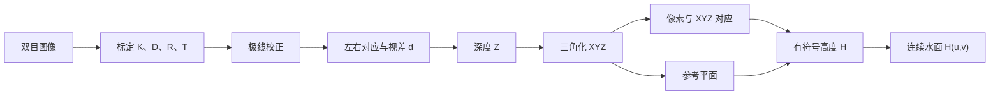

# 双目水面三维测量项目阶段性技术报告

## 1. 整体数学数据流

本项目的输入是同一时刻的左右图像

$$
I_L(u,v,t),\qquad I_R(u,v,t),
$$

目标是在主相机像素域得到相对水面高度

$$
H(u,v,t).
$$

```mermaid
flowchart LR
  A["双目图像"] --> B["标定 K、D、R、T"]
  B --> C["极线校正"]
  C --> D["左右对应与视差 d"]
  D --> E["深度 Z"]
  E --> F["三角化 XYZ"]
  F --> G["像素与 XYZ 对应"]
  F --> H["参考平面"]
  G --> I["有符号高度 H"]
  H --> I
  I --> J["连续水面 H(u,v)"]
```

整条链不是根据颜色猜测高度，而是逐级求解新的几何或物理未知量：标定给出相机参数，双目对应给出视差，视差和三角化给出三维点，参考平面把相机深度转换成水面法向高度，最后利用有依据的空间约束处理稀疏区域。合成实验用于检验理想条件下的数学正确性，真实视频实验用于暴露标定、匹配和稳定性边界；两类证据不能混为一谈。

## 2. 相机成像与双目标定模型

### 2.1 针孔成像模型

**目的：** 建立空间点与图像像素之间的确定关系。

**数学模型：**

$$
s\left[\begin{array}{c}u\\v\\1\end{array}\right]
=K[R\mid t]
\left[\begin{array}{c}X\\Y\\Z\\1\end{array}\right],
\qquad
K=\left[\begin{array}{ccc}
f_x&0&c_x\\0&f_y&c_y\\0&0&1
\end{array}\right].
$$

若空间点已表示在相机坐标系中，则

$$
u=f_x\frac{X}{Z}+c_x,\qquad
v=f_y\frac{Y}{Z}+c_y.
$$

**物理/几何意义：** $(X,Y,Z)$ 是空间点，$(u,v)$ 是像素；$R,t$ 描述相机姿态，$K$ 描述焦距和主点。一张图像只确定一条空间射线，不能唯一确定深度 $Z$，因此需要第二台相机。镜头畸变由径向因子 $1+k_1r^2+k_2r^4+k_3r^6$ 和切向参数 $p_1,p_2$ 描述，标定后先去畸变再进行双目计算。

### 2.2 单目与双目标定

**目的：** 从棋盘观测求出内参、畸变和左右相机相对位姿。

棋盘真实点与检测像素分别记为

$$
P_j=(X_j,Y_j,0)^T,\qquad p_{ij}=(u_{ij},v_{ij})^T.
$$

标定寻找参数 $\theta$，使重投影误差最小：

$$
\min_{\theta}\sum_i\sum_j
\left\|p_{ij}-\hat p(K,D,R_i,t_i,P_j)\right\|^2,
$$

$$
RMS=\sqrt{\frac{1}{N}\sum_n\|p_n-\hat p_n\|^2}.
$$

双目外参满足

$$
P_R=RP_L+T,\qquad B=\|T\|.
$$

$R$ 表示左右相机相对方向，$T$ 表示相对位置，$B$ 是基线。针对两台相机不总能在同一帧完整看到棋盘的问题，项目采用 split calibration：

$$
\{p^L\}\rightarrow K_L,D_L,\qquad
\{p^R\}\rightarrow K_R,D_R,
$$

$$
\{p^L,p^R\}_{bilateral}\rightarrow R,T.
$$

双目阶段使用固定内参约束。其原则是：不同未知量使用能够真正约束它的信息，而不是强迫所有参数依赖同一种帧。

### 2.3 对应实验：标定从受控数据到真实视频

**为什么做：** 先证明标定实现本身正确，再判断真实视频中的误差来自算法还是采集几何。

| 实验 | LEFT mono | RIGHT mono | Stereo | Epipolar | Rectified vertical | Baseline |
|---|---:|---:|---:|---:|---:|---:|
| Golden calibration | 0.1954 px | 0.2070 px | 0.2168 px | 0.1769 px | 0.1707 px | - |
| HomeTank_004 | 4.381 px | 4.525 px | 7.922 px | 9.508 px | 21.123 px | 68.685 mm |
| HomeTank_005 | 3.693 px | 3.287 px | 3.694 px | 3.708 px | 13.045 px | - |

HomeTank_005 使用 LEFT 179 帧、RIGHT 86 帧、双侧共同可见 63 帧，并结合 split calibration、17 个姿态组、5-fold grouped cross-validation 和 4/5 参数畸变比较。与 004 相比，Stereo RMS 从 7.922 降至 3.694 px，Epipolar RMS 从 9.508 降至 3.708 px，校正后垂直残差从 21.123 降至 13.045 px。

**实验结论：** Golden case 证明基础实现和接口在良好观测下成立；004 量化暴露了真实标定不稳定；005 的分离标定明显改善平均误差。但 005 的 focal、principal point、baseline 稳定性指标仍约为 29.32%、32.31%、32.16%，rotation 变化约 4.617°，因此不能称为最终高精度标定。

## 3. 极线、视差与深度模型

### 3.1 极线几何

**目的：** 把右图中的对应点搜索从整幅图像缩小到一条极线附近。

$$
E=[T]_{\times}R,\qquad
F=K_R^{-T}EK_L^{-1},\qquad
x_R^TFx_L=0.
$$

极线校正后，理想对应点应处于同一水平行：

$$
v_L\approx v_R,\qquad e_v=v_L-v_R.
$$

004 的 vertical RMS 为 21.123 px，005 为 13.045 px。结果虽有改善，但仍显著弱于 Golden case 的 0.1707 px，这直接限制了可靠匹配数量。

### 3.2 视差—深度推导

平行双目模型中

$$
u_L=f\frac{X}{Z}+c_x,\qquad
u_R=f\frac{X-B}{Z}+c_x.
$$

定义视差 $d=u_L-u_R$，两式相减得到

$$
d=\frac{fB}{Z},\qquad
\boxed{Z=\frac{fB}{d}}.
$$

直观上，视差越大表示空间点越近；视差越小表示越远。对深度公式求导：

$$
\frac{\partial Z}{\partial d}=-\frac{Z^2}{fB},
\qquad
\boxed{|\delta Z|\approx\frac{Z^2}{fB}|\delta d|}.
$$

该式表明：距离越远，同样的视差误差产生更大的深度误差；增大基线或焦距可改善理论灵敏度，但基线过大又会缩小公共视场。

### 3.3 对应实验：搜索范围、距离与基线

**为什么做：** 判断真实支持率低是否仅由搜索范围造成，并检验 $Z^2/(fB)$ 的误差趋势。

**结果：** 将 disparity range 扩大至 1280/2560 后，支持率没有根本改善，反而出现错误匹配和负深度，因此排除了“只扩大搜索范围即可解决”的假设。

| 工作距离 | 理论视差 | 理论灵敏度 | 关键结果 |
|---:|---:|---:|---|
| 1.75 m | 265.010 px | 6.604 mm/px | RMSE 2.832 mm；raw support 71.758%，FAIL |
| 2.00 m | 231.884 px | 8.625 mm/px | RMSE 1.030 mm；raw support 100%，PASS |
| 2.50 m | 185.507 px | 13.477 mm/px | 平面拟合前终止，不生成高度 |

| 基线 | 理论视差 | RMSE | MAE | 最大误差 |
|---:|---:|---:|---:|---:|
| 0.15 m | 173.913 px | 1.483 mm | 1.205 mm | 5.048 mm |
| 0.20 m | 231.884 px | 1.030 mm | 0.849 mm | 3.398 mm |
| 0.25 m | 289.855 px | 0.906 mm | 0.743 mm | 3.094 mm |

**实验结论：** 受控范围内，增大基线改善了深度误差，与理论一致；但 1.75 m 案例说明工作距离还受公共视场与匹配支持制约，不能只看公式中的单一灵敏度。

## 4. 三角化与 WASS 三维重建模型

### 4.1 两条观测射线恢复三维点

**目的：** 由左右对应像素恢复空间坐标。

$$
x_L\sim P_LX,\qquad x_R\sim P_RX,
$$

每个观测都可写成线性约束

$$
x\times PX=0.
$$

左右像素分别定义一条空间射线，联合求解得到 $X=(X,Y,Z)^T$。WASS 在这一阶段完成特征/稠密对应、视差和三角化，输出 XYZ；它没有改变上述双目几何依据。

### 4.2 对应实验：理想闭环与真实支持漏斗

**为什么做：** 区分“三角化公式错误”和“可用左右对应不足”。

合成相机为 2448×2048 像素、3.45 μm 像元、8 mm 焦距、$B=0.20$ m、$Z=2.00$ m：

$$
f_{px}=\frac{8}{0.00345}=2318.8406\ \mathrm{px},
\qquad d=\frac{f_{px}B}{Z}=231.8841\ \mathrm{px}.
$$

虚拟图像测得 232 px。4331 个平面点三维 RMSE 为 $9.51\times10^{-16}$ m，4331 个正弦曲面点为 $9.71\times10^{-16}$ m，说明理想投影、坐标方向与三角化达到浮点精度闭环。

真实 HomeTank_004 的公共视场为 2,073,600 像素，成功 triangulated 229,164 点，占 11.052%；最终 XYZ 为 135,205 点，占 6.520%。三个静水帧的单帧平面 RMS 分别为 2.249、2.161、2.007 mm，但 mean Z 跨度达到 97.233 mm，法向最大变化 12.166°。

**实验结论：** 理论三角化实现正确；真实水面的主要瓶颈是可靠对应不足与跨帧几何漂移。“单帧点云较平”不等于“跨帧三维坐标稳定”。

## 5. 像素—三维对应模型

**目的：** 把 WASS 的 XYZ 重新映射到最终高度图所在的 canonical RIGHT/cam1 像素域。

$$
\widetilde p=K_R
\left[\begin{array}{c}X\\Y\\Z\end{array}\right],
\qquad
u=f_x\frac{X}{Z}+c_x,\quad
v=f_y\frac{Y}{Z}+c_y.
$$

因此必须显式建立

$$
(u,v)\longleftrightarrow(X,Y,Z).
$$

**对应实验：** 一次闭环检查中，WASS 已有 98,438 个有限 XYZ，但初始投影得到 OBSERVED=0，与成像模型矛盾。核查发现 WASS 的 row-major inverse rotation 在 Python 端被额外转置；修正后，98,438 点全部投回 1920×1080 图像、有效域和 ROI。

**实验结论：** “存在 XYZ”不等于“像素映射自动正确”。该实验单独闭合了三维坐标约定与二维显示域，是后续逐像素高度计算的必要条件。

## 6. 参考平面与水面高度模型

### 6.1 参考平面

**目的：** 建立静水零高度面。相机 $Z$ 是沿光轴的深度，并不等于沿水面法向的高度。

$$
aX+bY+cZ+d=0,
\qquad n^TP+d=0,
$$

$$
\min_{n,d}\sum_i(n^TP_i+d)^2,
\qquad \|n\|=1.
$$

对参考点云去中心化后，变化最小的方向由 SVD 给出，作为平面法向 $n$。

### 6.2 有符号相对高度

measurement point 到参考面的有符号正交距离为

$$
\boxed{
H=\frac{aX+bY+cZ+d}{\sqrt{a^2+b^2+c^2}}
}.
$$

若法向已经单位化，则

$$
H=n^TP+d.
$$

这才是项目中的“相对水面高度”：它沿参考面法向测量，而不是直接把相机深度 $Z$ 当作波高。

### 6.3 对应实验：零高度、固定高度与真实参考面

| 实验 | 为什么做 | 关键结果 | 作用 |
|---|---|---|---|
| Synthetic Case 0 静水 | 检验 reference、符号和零高度闭环 | 4,313,574 XYZ/帧；direct support 86.039%；grid coverage 100%；H RMSE 0.00446 mm | 证明确定性静水链数值闭环，不代表真实微米精度 |
| Synthetic Case 1 +10 mm | 检验非零高度的尺度、方向和参考差分 | 初始 mean 8.889 mm、RMSE 11.080 mm、max 75.466 mm，FAIL；单因素调整后 mean 9.107 mm、bias -0.893 mm、RMSE 1.027 mm、MAE 0.916 mm、max 1.641 mm、coverage 100% | 定位主要损失来自 depth component filtering，并验证理想条件下的非零高度链 |
| 真实 reference | 检验真实 XYZ 能否进入参考平面链 | 时间 8.574578 s；101,548 XYZ；plane RMS 29.923 mm | 证明正式链可运行，同时表明真实参考质量不足以支持毫米级物理精度声明 |

## 7. 连续水面高度场模型

### 7.1 规则波与多分量波

规则波模型为

$$
H(x,t)=A\sin(kx-\omega t+\phi),
\qquad k=\frac{2\pi}{\lambda},\quad \omega=2\pi f.
$$

$A$ 是振幅，$\lambda$ 是波长，$f$ 是频率，$\phi$ 是初始相位。多分量不规则波写成

$$
H(x,t)=\sum_{m=1}^{3}A_m\sin(k_mx-\omega_mt+\phi_m).
$$

**对应实验：规则波。**

| 组别 | 振幅/频率 | RMSE | 恢复振幅 | 相位误差 |
|---|---:|---:|---:|---:|
| G0 | 10 mm / 0.5 Hz | 0.859 mm | 9.694 mm | +0.000207 rad |
| G1 | 30 mm / 0.5 Hz | 1.030 mm | 29.596 mm | +0.000406 rad |
| G2 | 10 mm / 1.0 Hz | 0.739 mm | 9.689 mm | -0.002633 rad |
| G3 | 30 mm / 1.0 Hz | 1.131 mm | 29.659 mm | -0.003247 rad |

四组恢复波长均为 0.800 m，频率误差均为 0 Hz。初始 0.7853 rad 相位差最终定位为 0.10 m 空间原点差；修正评价坐标后相位误差接近 0。该实验表明受控合成链能够保持振幅、波长、频率和相位。

**对应实验：不规则波。** 三个分量的振幅为 15/8/5 mm，波长为 0.80/0.50/1.20 m，频率为 0.50/0.80/0.30 Hz。已有冻结子集版本得到 bias +0.036 mm、RMSE 2.368 mm、MAE 1.882 mm、P95 4.672 mm、max 8.732 mm。原始 IRR-1 自动标定失败被保留；完成版本证明同一链可处理多波长、多频率叠加的确定性曲面。

### 7.2 从稀疏观测到连续水面

**目的：** 只有成功匹配的像素具有直接观测高度 $(u_i,v_i,H_i^{obs})$，完整像素域需要在明确约束下补全，而不能任意赋值。

$$
H(x,y)=H_{base}(x,y)+\delta H(x,y),
$$

$$
\boxed{
\min_h
\sum_iw_i(h_i-H_i^{obs})^2
+\lambda_1\|\nabla h\|^2
+\lambda_2\|\Delta h\|^2
}.
$$

第一项要求曲面贴近观测，梯度项抑制相邻像素突然跳变，曲率项抑制尖峰和异常弯曲。

**对应实验：** 无约束 global RBF 的高度范围达到 -103.177 至 +508.741 mm，发生明显外推发散，因此被拒绝。正则化曲面的 WASS 内部 hold-out 得到 MAE 4.329 mm、RMSE 5.234 mm、P95 10.249 mm、max 14.928 mm，完整场为 -9.686 至 +18.705 mm，未出现数百毫米发散。

**实验结论：** 连续水面必须同时服从观测和光滑约束。hold-out 的目标值仍来自 WASS，因此只证明内部曲面重现一致性，不是独立物理精度验证。

## 8. 完整数学链的合成实验

合成实验先生成可由左右虚拟相机读取的图像，再运行正式标定接口、WASS、三角化、网格化和高度模块。真值完全已知，所以可逐项检查数学链，而不受真实设备抖动、反光和曝光影响。

| 实验 | 为什么做 | 结果 | 对路线的作用 |
|---|---|---|---|
| 投影与三角化 | 检查坐标方向、视差符号和投影矩阵 | 平面/正弦 3D RMSE 分别为 $9.51\times10^{-16}$/$9.71\times10^{-16}$ m | 证明几何核心闭环 |
| 静水 Case 0 | 检查零高度与共同有效域 | H RMSE 0.00446 mm，coverage 100% | 进入非零高度验证 |
| +10 mm Case 1 | 检查符号、尺度和参考差分 | 调整后 RMSE 1.027 mm，mean 9.107 mm | 证明理想非零高度可恢复 |
| G0-G3 规则波 | 检查幅值、空间周期和时间周期 | RMSE 0.739-1.131 mm；波长 0.800 m；频率误差 0 | 进入复合曲面验证 |
| 三分量不规则波 | 检查多频率、多波长叠加 | RMSE 2.368 mm，P95 4.672 mm | 证明模型可处理确定性复合波 |
| 距离/基线 | 检查深度误差传播 | 基线 0.15/0.20/0.25 m 时 RMSE 1.483/1.030/0.906 mm | 把公式转化为相机布置依据 |

这些结果证明已知参数、理想成像条件下的算法闭环和参数趋势；它们不包含真实镜头不稳定、反光、同步和机械位移，不能直接当作真实手机水面的测量精度。

## 9. 真实手机视频实验

真实实验的作用不是重复合成结论，而是逐层检验理想假设在实际采集中的成立程度。

| 实验 | 为什么做 | 关键结果 | 作用 |
|---|---|---|---|
| HomeTank_004 标定 | 检查真实标定几何 | Stereo 7.922 px；Epipolar 9.508 px；vertical 21.123 px | 暴露真实参数不稳定 |
| HomeTank_005 split calibration | 使用各自可见帧约束不同未知量 | Stereo 3.694 px；Epipolar 3.708 px；vertical 13.045 px | 平均误差明显改善，但稳定性仍不足 |
| Disparity range | 检查搜索范围是否为唯一瓶颈 | 扩大范围仍未改善支持，并产生错配/负深度 | 排除单纯扩大范围的路线 |
| WASS support funnel | 定量定位点数损失 | 2,073,600 公共像素中 triangulated 11.052%，final XYZ 6.520% | 确认主要困难是可靠对应不足 |
| 跨帧静水 | 检查时间稳定性 | 单帧 plane RMS 2.007-2.249 mm；mean Z 跨度 97.233 mm；normal 变化 12.166° | 证明单帧平整不代表跨帧稳定 |
| Pixel closure | 检查 XYZ 与像素域坐标约定 | 98,438 XYZ 从 OBSERVED=0 修正为全部投回有效域 | 闭合三维—二维映射 |
| 真实 reference | 检查 XYZ 到高度链 | 101,548 XYZ；plane RMS 29.923 mm | 可进入 signed H，但不能声明毫米级精度 |

上述模型已连接为“同步双目视频 → 人工 ROI → 按需单帧 WASS → XYZ → pixel mapping → reference H → continuous height field → 展示/导出”。采用 on-demand single-frame 是因为 WASS 单帧计算较重，当前研究目标是按需测量，而非整段视频实时三维。自动公共视场的实际坐标映射仍不稳定，现阶段使用 RIGHT/cam1 完整画面和人工 ROI。

## 10. 模型—实验—结果总表

| 模型/阶段 | 核心公式 | 为什么需要 | 对应实验 | 关键结果 | 实验作用 |
|---|---|---|---|---|---|
| 针孔成像 | $s\,p=K[R\mid t]P$ | 联系三维点与像素 | Golden calibration | Stereo 0.2168 px | 证明基础实现成立 |
| 标定优化 | $\min\sum\lVert p-\hat p\rVert^2$ | 求 $K,D,R,T$ | 004/005 | Stereo 7.922→3.694 px | 量化真实采集改进与边界 |
| Split calibration | 单目分别求内参，双侧帧求外参 | 充分利用不同可见帧 | 005 grouped CV | 179/86/63 帧，17 pose groups | 改善平均标定误差 |
| 极线几何 | $x_R^TFx_L=0$ | 缩小对应点搜索域 | Golden/004/005 | vertical 0.1707/21.123/13.045 px | 解释真实匹配困难 |
| 视差—深度 | $Z=fB/d$ | 由像素位移求深度 | disparity range | 扩大范围未根本改善 | 排除搜索范围唯一假设 |
| 深度不确定度 | $\lvert\delta Z\rvert\approx Z^2\lvert\delta d\rvert/(fB)$ | 评价相机布置 | 距离/基线 | B 增大时 RMSE 1.483→0.906 mm | 验证受控趋势 |
| 三角化 | $x\times PX=0$ | 两条射线恢复 XYZ | Synthetic closure | 3D RMSE 约 $10^{-15}$ m | 证明几何实现正确 |
| WASS 重建 | correspondence→disparity→XYZ | 从真实图像产生三维点 | 004 support funnel | final XYZ 6.520% | 定位可靠对应不足 |
| 像素投影 | $u=f_xX/Z+c_x$ | 把 XYZ 放回高度图 | 98,438 点闭环 | 修正后全部投回有效域 | 统一二维/三维坐标约定 |
| 参考平面 | $n^TP+d=0$ | 建立静水零面 | Case 0/真实 reference | 100% grid；真实 plane RMS 29.923 mm | 验证链路并暴露真实质量边界 |
| 有符号高度 | $H=n^TP+d$ | 得到沿水面法向的相对高度 | +10 mm Case 1 | mean 9.107 mm，RMSE 1.027 mm | 验证符号和尺度 |
| 规则波 | $A\sin(kx-\omega t+\phi)$ | 表达振幅、波长与频率 | G0-G3 | 波长 0.800 m，频率误差 0 | 验证波形参数保持 |
| 多分量波 | $\sum A_m\sin(\cdots)$ | 表达复合水面 | Irregular wave | RMSE 2.368 mm | 验证确定性叠加曲面 |
| 正则连续水面 | 数据项+梯度项+曲率项 | 从稀疏观测恢复连续场 | RBF/regularized | RBF 发散；正则场 -9.686 至 +18.705 mm | 拒绝无约束外推路线 |

## 11. 阶段结论

**已建立的模型。** 项目已经形成成像、单目/双目标定、极线约束、视差—深度、深度不确定度、三角化、pixel↔XYZ、参考平面、有符号高度、规则/多分量波以及正则连续水面的连贯数学链。

**已完成的实验验证。** 合成数据在已知真值下完成静水、+10 mm、规则波、不规则波以及基线/距离实验；Golden case 证明标定实现正常。真实 HomeTank_004 量化暴露标定、支持率和跨帧问题；HomeTank_005 通过新采集和 split calibration 得到明确改善。真实 WASS 已产生数万至十万量级 XYZ，并进入像素映射、参考平面和高度流程。

**当前边界。** 真实 calibration parameter stability 仍不足；direct stereo support 仍偏低；实时任意参考面的稳定性仍需提高；真实物理 ground truth 精度验证尚未完成。因此当前成果是“数学模型与阶段性实验链已经建立”，而不是“真实水面已经达到毫米级测量精度”。
