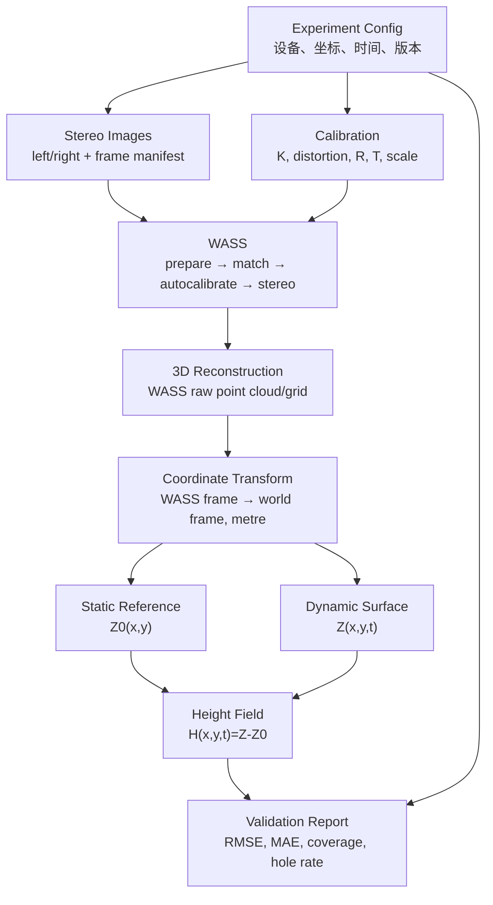

# 双目测波数据流设计

## 1. 目标

本设计连接实验配置、双目数据、WASS 重建和项目高度产品，使仿真与未来真实工业相机数据使用相同的接口语义。它只定义数据流和责任边界，不实现核心算法。

## 2. 总体数据流

## 3. 阶段接口

| 阶段 | 输入 | 输出 | 关键约束 |
|---|---|---|---|
| Experiment Config | 参数登记、研究计划 | 冻结 YAML | UNKNOWN 必须为 null；记录来源/状态/单位 |
| Stereo Images | 仿真投影或实体相机 | 左右图、frames manifest | 同 frame_id、明确时钟、无损格式 |
| Calibration | 标定/仿名义参数 | `K`、畸变、`R,T`、尺度 | `SIMULATION_NOMINAL` 与 `CALIBRATED` 分开 |
| WASS | 图像、标定和 WASS 配置 | 原始点云、矩阵、日志 | 不读取真值高度；不修改 WASS |
| 3D Reconstruction | WASS 原始输出 | 带 provenance 的原始重建登记 | 原始单位/坐标未确认时保持 UNKNOWN |
| Coordinate Transform | 原始点、尺度、外部控制 | 世界坐标点（m） | 记录变换方向、ID、来源和不确定度 |
| Static Reference | 独立静水重建 | `Z0[y,x]`、mask、统计 | 与动态数据同坐标和网格 |
| Height Field | `Z[t,y,x]`、`Z0[y,x]` | `H[t,y,x]`、联合 mask | `H=Z-Z0`，无效值为 NaN |
| Validation Report | 高度、参考、mask、阈值 | 指标和 pass/fail | ROI、样本数和阈值预先冻结 |

## 4. 来源分支

### 仿真数据

解析真值和虚拟相机生成左右图，`source_type=simulation`。真值保存在隔离目录，只供 WASS 完成后的评价；WASS 输入与实体数据保持相同图像/标定/帧清单接口。

### 实体相机数据

相机 SDK 产生原始 Bayer/无损文件，`source_type=physical_camera`。当前 MER2-503-36U3C 仅为 candidate；设备序列号、真实内参、基线、工作距离和同步误差均为 `UNKNOWN/TODO`。

两条分支在“规范化双目数据集”处合流，但来源、状态、时钟域和标定类别不得被抹去。

## 5. 坐标与单位闸门

在进入下一阶段前依次检查：

1. 图像坐标是 px，原点和 `u/v` 方向符合 [统一坐标规范](../data_model/coordinate_system.md)；
2. 帧具有 `timestamp_ns`、时间基准和配对状态；
3. WASS 原始坐标、单位和尺度状态已登记；
4. 转换到世界坐标后长度单位为 m、`+Zw` 向上；
5. `Z` 与 `Z0` 使用同一 `[y,x]` 网格；
6. mask 为假时浮点值为 NaN，不以零代替缺失值。

任一闸门失败时停止生成科学高度产品。

## 6. 数据谱系

每个输出通过 `experiment_id`、`frame_id`、配置哈希、输入 SHA-256、WASS 版本和项目 commit 追溯到输入。原始数据、WASS 原始输出、标准世界坐标产品和验证报告分层保存，不能覆盖。接口详情见：

- [双目图像数据集](../data_model/stereo_image_dataset_spec.md)
- [重建输出接口](../data_model/reconstruction_output_spec.md)
- [实验元数据](../data_model/experiment_metadata_spec.md)
- [实验配置模板](../../configs/experiment/experiment_template.yaml)

## 7. 当前 UNKNOWN/TODO

- 实体设备时钟和曝光时间语义；
- 同步验收阈值；
- 实际基线、工作距离和水槽坐标控制点；
- WASS 原始点云到物理尺度的首轮实机核验结果；
- 标准点表/网格的最终存储编码和 schema 版本策略。
