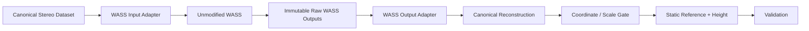

# WASS 集成架构

## 1. 系统位置

WASS 是本项目唯一的核心双目三维重建引擎：

```text
Stereo Images
  ↓
Calibration
  ↓
WASS
  ├─ wass_prepare
  ├─ wass_match（外参未知时）
  ├─ wass_autocalibrate（外参未知时）
  └─ wass_stereo
  ↓
3D Reconstruction / wassgridsurface
  ↓
Project Height Processing
```

本项目通过文件和配置边界调用锁定的 WASS `v_1.5`，不复制、不修改其源码，也不实现替代的 stereo matching、三角测量或点云重建。处理链依据见 [WASS pipeline 分析](pipeline_analysis.md) 和 [输入输出规范](input_output_spec.md)。

## 2. 职责边界

### WASS 负责

- 读取标定和成对双目图像；
- 图像准备、去畸变和重建准备；
- 稀疏 stereo matching 与外参估计；
- 多帧自动标定；
- dense stereo、三角测量和三维点云生成；
- WASS 原生诊断、日志和可选平面/网格相关输出。

上述职责由上游实现完成。本项目不把真值视差、第三方匹配结果或自研点云生成器注入正式 WASS 链。

### 本项目负责

- 按 [双目图像规范](../data_model/stereo_image_dataset_spec.md) 组织数据、帧对、时间和 provenance；
- 将规范数据适配为 WASS 可接受的目录、图像和标定文件；
- 原样登记 WASS 输出并解析已确认的文件格式；
- 验证物理尺度，将 WASS 坐标转换到统一世界坐标；
- 映射到规则网格 `Z(x,y,t)`；
- 通过未来独立静水实验建立 `Z0(x,y)`；
- 计算 `H(x,y,t)=Z(x,y,t)-Z0(x,y)`；
- 计算覆盖率、空洞率、RMSE、MAE 等质量指标。

## 3. 集成分层



各层规则：

1. **Canonical Stereo Dataset** 保留仿真/实体来源、原始时间和标定状态；
2. **WASS Input Adapter** 只做目录、命名、无损格式和 XML/配置适配，不改变几何意义；
3. **Unmodified WASS** 使用锁定二进制和配置运行；
4. **Raw Outputs** 原样保存文件、日志和哈希；
5. **Output Adapter** 只解析被源码/官方文档确认的格式，未知字段保持 UNKNOWN；
6. **Coordinate / Scale Gate** 未通过时禁止输出单位为 m 的科学高度；
7. **Height / Validation** 属于项目后处理，不回写 WASS 工作目录。

## 4. 输入边界

输入适配器接收：

- 左右图路径、`frame_id`、`timestamp_ns` 和时间基准；
- 左右相机 ID 与内参/畸变引用；
- 可选且有明确方向的外参；
- matcher/stereo 配置和 WASS 版本；
- 图像转换 provenance。

输出为 WASS `cam0/cam1` 或命令行所需路径、标定 XML、配置及 work session。候选工业相机 Bayer 数据到灰度输入的具体转换实现仍为 `UNKNOWN/TODO`，不能由适配器静默决定。

## 5. 输出边界

WASS 原始输出包括已在源码分析中确认的点云、矩阵、平面、视差诊断和日志；网格可由锁定 `wassgridsurface` 生成。项目适配器将这些内容映射到 [WASS 输出规范](../data_model/wass_output_spec.md)，但必须保存：

- 原始文件路径与 SHA-256；
- WASS tag/commit、二进制和配置哈希；
- 源坐标系、源单位和尺度状态；
- `frame_id` 与时间关联；
- 解析器 schema/version。

不能确认的 NetCDF 字段、压缩点云单位或版本差异标为 `UNKNOWN/TODO`，不得根据文件名猜测。

## 6. 软件模块边界（仅设计）

本轮不创建代码，只定义未来职责：

| 建议模块 | 职责 | 明确禁止 |
|---|---|---|
| `src/adapters/wass/input` | 标准数据集到 WASS 文件/目录/配置 | 不做 stereo matching |
| `src/adapters/wass/output` | 读取已确认 WASS 文件并形成标准重建接口 | 不重建缺失点、不猜单位 |
| `src/geometry` | 已知变换的坐标统一、尺度状态和单位检查 | 不估计替代 WASS 的双目几何 |
| `src/reference` | `Z0` 策略接口、状态和 provenance | 不提前固定静水估计方法 |
| `src/height` | 同网格 `H=Z-Z0` 和 mask 传播 | 不进行立体重建 |
| `src/validation` | RMSE、MAE、max、coverage、hole rate | 不修改输入以获得通过结果 |

模块之间只交换 [统一坐标规范](../data_model/coordinate_system.md) 和 [标准重建接口](../data_model/reconstruction_output_spec.md) 定义的数据。

## 7. 失败闸门

以下任一情况必须停止高度产品生成：

- 左右帧、时间基准或标定引用不一致；
- WASS 运行失败或原始输出缺失；
- 点云格式/单位/坐标方向无法由来源确认；
- 物理尺度未恢复；
- 世界坐标变换未定义；
- 静水参考与动态网格不兼容；
- mask 或 NaN 语义不符合数据接口。

失败状态进入实验元数据和验证报告，不能通过默认值掩盖。

## 8. 版本与只读规则

WASS 上游、commit、子模块、构建环境和运行配置必须冻结。任何需要修改 WASS 的问题先记录为外部依赖 issue/TODO；本仓库不得直接改 `external/WASS` 源码。项目后处理输出写入独立目录，不覆盖 WASS 工作产物。
