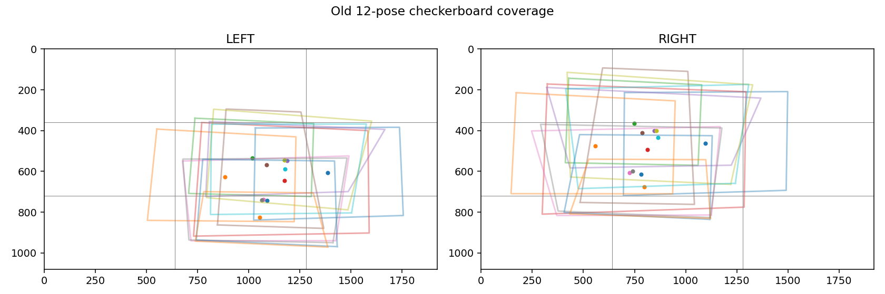
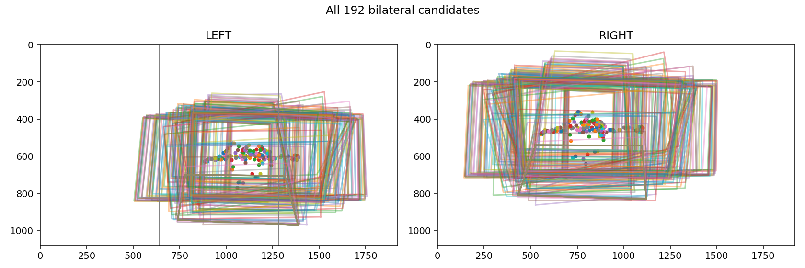
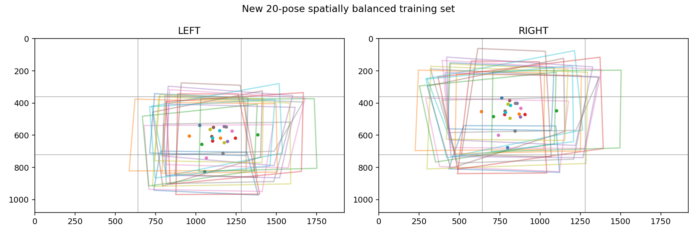
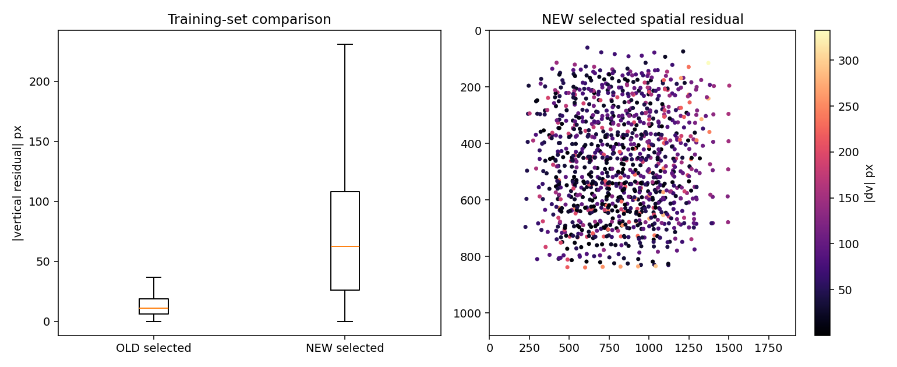
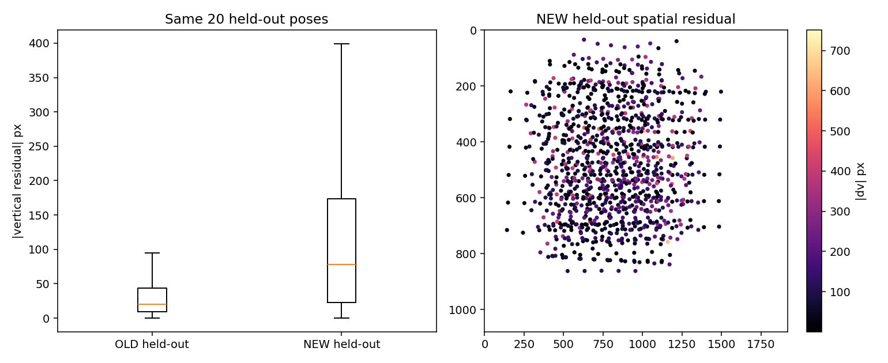
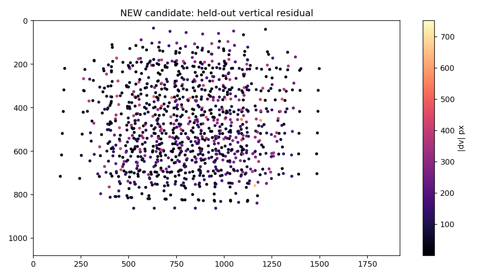

# HomeTank_004 spatial-coverage calibration salvage

## Scope

This experiment asks only whether the existing calibration videos can produce
a materially better spatial stereo calibration through pose selection. It uses
the 192 frozen bilateral checkerboard detections, OpenCV's unchanged
`calibrateCamera`, `stereoCalibrate(CALIB_FIX_INTRINSIC)`, and
`stereoRectify(CALIB_ZERO_DISPARITY, alpha=0)`. It does not read ruler,
static/wave reconstruction, GUI ROI, or WASS results. WASS execution count is
zero, and the frozen `calibration_result.yaml` is unchanged.

Checkerboard geometry remains 9×6 inner corners with 20 mm squares.

## Why the old 12 poses failed spatially

The old 12-pose set occupies only three left-camera and two right-camera cells
of a 3×3 image grid:

| Camera | 3×3 occupancy, row-major |
|---|---|
| LEFT | `0,0,0 / 0,7,1 / 0,4,0` |
| RIGHT | `0,0,0 / 1,11,0 / 0,0,0` |

It is concentrated in the centre and lower-centre of LEFT and almost entirely
the centre of RIGHT. It lacks top, corners, and most side coverage. Board-scale
variation exists, but it cannot constrain distortion and rectification across
the full frame. The old vertical residual—median 10.995 px, RMS 21.123 px, P95
46.281 px—is therefore consistent with poor spatial constraint.

## What the 192 candidates contain

The frozen artifacts already contain timestamps, all 54 corners per camera,
centres, bounding boxes, area, perspective proxy and sharpness, so no video was
rescanned. A single fixed robust prefilter rejected the lowest 5% bilateral
sharpness (10 pairs) and lowest 5% board area (10 pairs), leaving 172
quality-valid candidates. No complete-corner, edge-margin, or order-ambiguity
failure remained.

Critically, all 192 detections themselves occupy only three LEFT cells and
three RIGHT cells:

| Camera | All-candidate 3×3 occupancy |
|---|---|
| LEFT | `0,0,0 / 0,150,22 / 0,20,0` |
| RIGHT | `0,1,0 / 20,171,0 / 0,0,0` |

Thus selection cannot manufacture the missing top/corner/side observations.

## Deterministic selection and validation

The bilateral descriptor contains normalized centres, logarithmic board area,
`sin/cos` orientation, perspective proxy, and bilateral sharpness. Circular
orientation avoids the ±π discontinuity. A deterministic greedy selector first
rewards new 3×3 cells and then maximizes nearest descriptor distance, with a
fixed duplicate threshold of 0.020. It selected 20 training poses.

Another 20 spatially distributed poses were frozen as validation before fitting.
They are disjoint from both the new training set and the old 12-pose training
set, so OLD and NEW are compared on exactly the same unseen frames.

The new training set still occupies only three LEFT and two RIGHT cells because
the source data has no broader support.

## OLD versus NEW

| Metric | OLD | NEW candidate |
|---|---:|---:|
| Mono RMS LEFT | 4.3805 px | 4.0737 px |
| Mono RMS RIGHT | 4.5253 px | 4.2539 px |
| Stereo RMS | 7.9224 px | 7.7175 px |
| Epipolar RMS, training | 9.5084 px | 10.4352 px |
| Training vertical median | 10.9949 px | 62.6422 px |
| Training vertical RMS | 21.1225 px | 100.9972 px |
| Training vertical P95 | 46.2810 px | 208.6118 px |
| Training vertical max | 92.5259 px | 332.3397 px |
| Held-out vertical median | 20.3907 px | 78.2995 px |
| Held-out vertical RMS | 39.4829 px | 172.3818 px |
| Held-out vertical P95 | 83.1450 px | 381.3963 px |
| Held-out vertical max | 151.3597 px | 750.9088 px |

The modest mono/stereo objective decrease does not transfer to rectification.
On the fair held-out set, NEW is substantially worse everywhere, not merely at
one edge. It is not a central-region improvement and must not be promoted.

## Physical sanity

All NEW `K/D/R/T` values are finite, focal lengths and principal points remain
inside a broadly plausible image scale, and relative rotation is 6.739°. But
the baseline is 76.6404 mm: 6.6404 mm or 9.486% above the manual 70 mm sanity
reference. The LEFT fifth radial coefficient reaches 6.6379, another sign that
the distortion model is poorly constrained by the available spatial coverage.
These are rejection evidence; manual baseline was never used to rescale `T`.

## Conclusion and next action

Classification: `EXISTING_CALIBRATION_VIDEO_NOT_SUFFICIENT` and
`NEW_CALIBRATION_CAPTURE_REQUIRED`.

The next single action is one new calibration capture after the stereo rig is
fixed. The board must be flat, rigid and sharp in both cameras and must cover
left-top, top-centre, right-top, left-middle, centre, right-middle, left-bottom,
bottom-centre and right-bottom. Each region needs near/mid/far scale variation
and frontal/tilted poses. Both cameras must see the complete board; motion blur,
glare, board bending, refocusing and rig movement must be avoided.

No WASS A/B run is justified because the candidate failed held-out
rectification and physical sanity. The candidate is retained only as a rejected,
traceable artifact; the formal calibration baseline, reconstruction and GUI are
unchanged.
