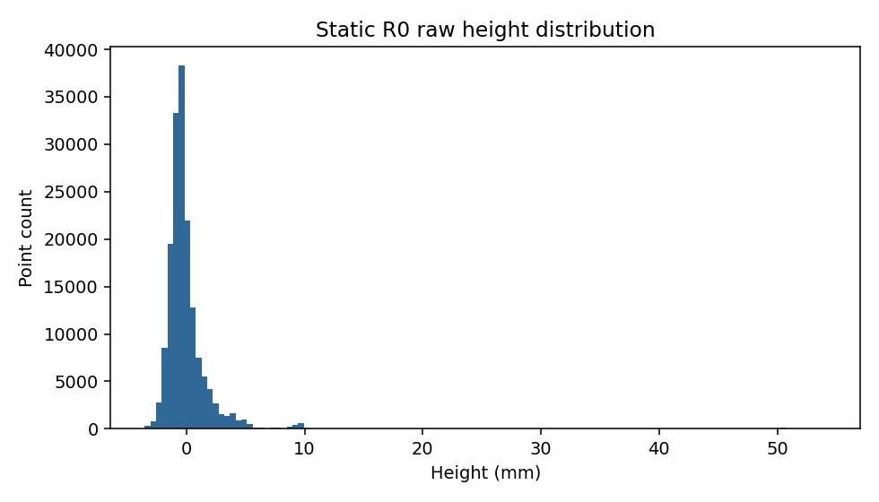
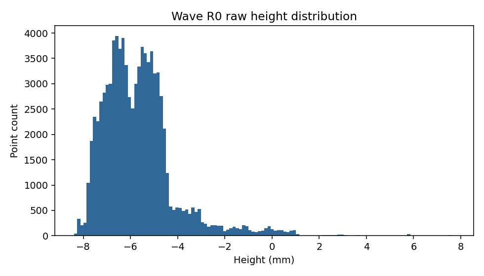
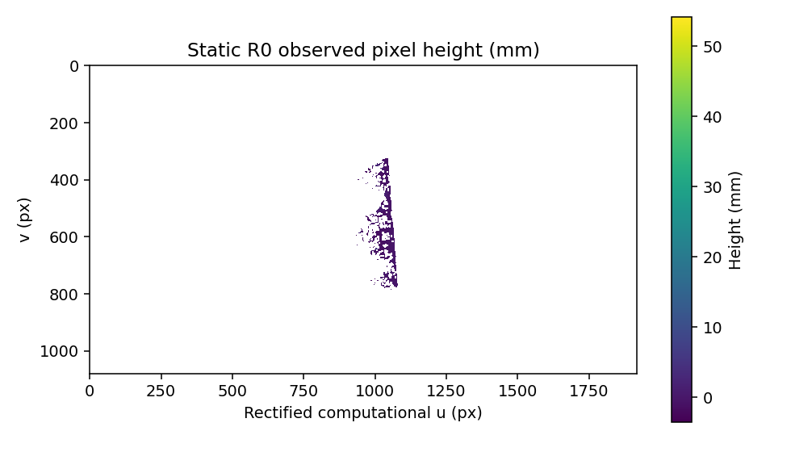
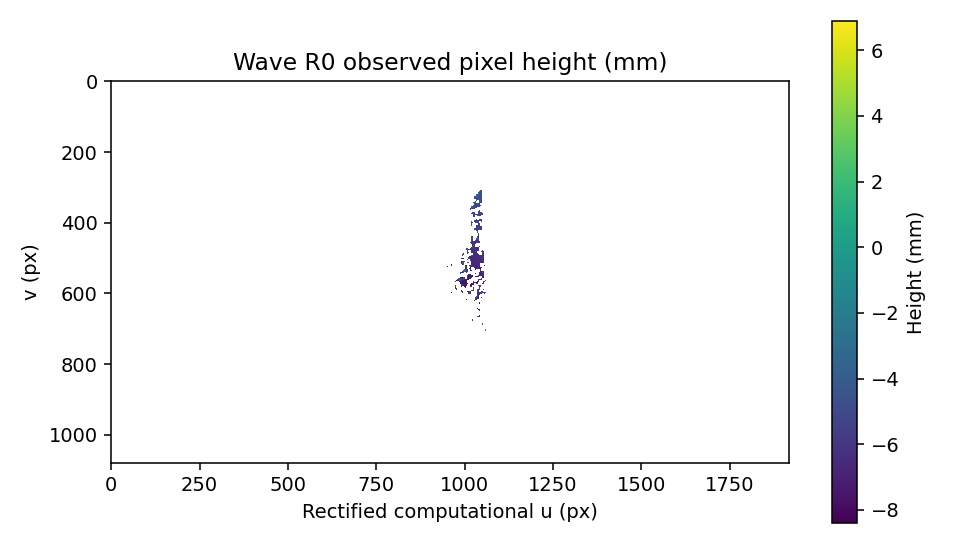
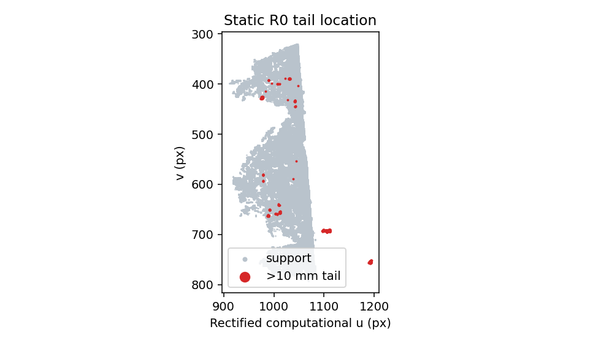
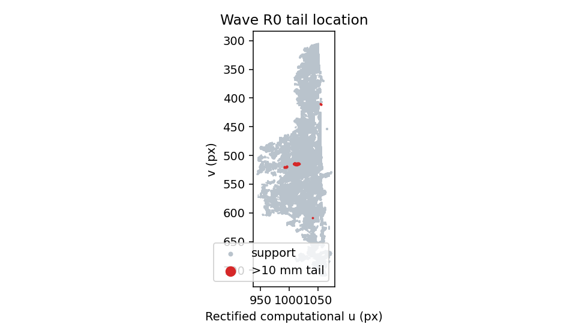
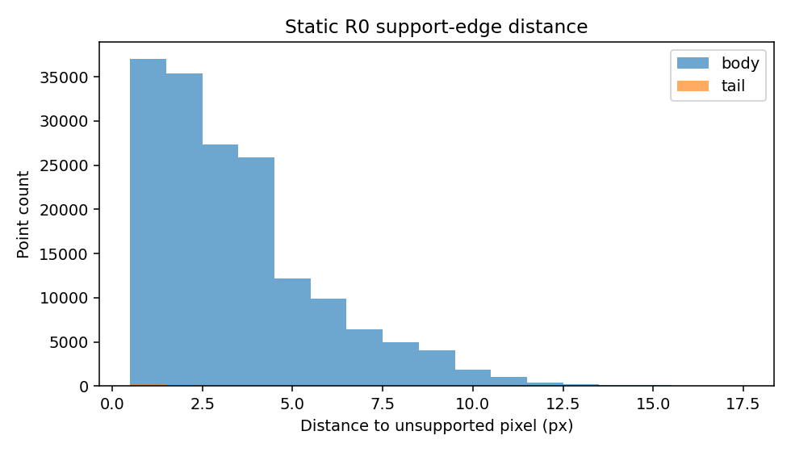
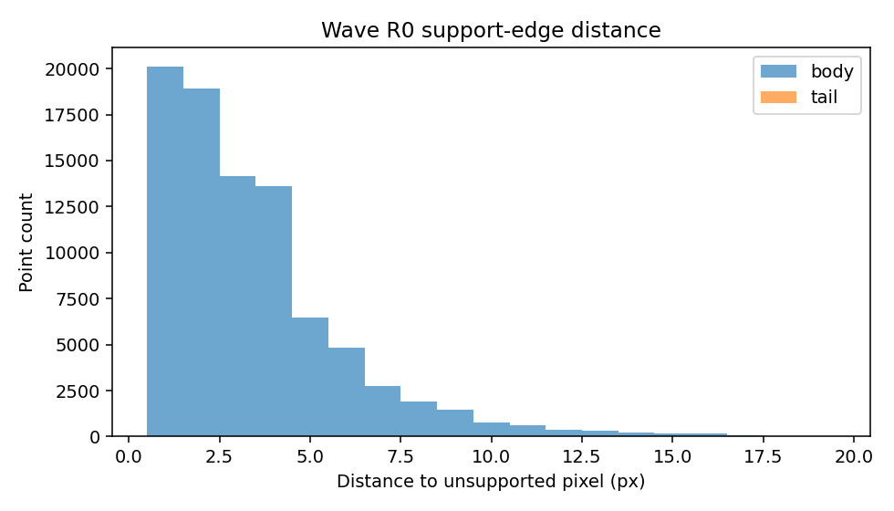

# HomeTank_004 Phase 3 Single-frame Height QA

## Audit boundary

This is a read-only audit of the frozen Static R0 and Wave R0 outputs. No calibration, synchronization, WASS, reference plane, height value, threshold, or frame selection was changed. No ruler file, ROI, scale, or physical ground truth was read.

The pixel domain is `wass_rectified_computational_cam0__input_right`, not raw unrectified camera pixels. Sparse support is rasterized only at observed projected pixels. Unsupported pixels remain absent/NaN and are never interpreted as zero height. Multiple 3D samples at one projected pixel are retained in point statistics; their median is used only for the QA display raster.

## Height distribution

| Metric | Static R0 | Wave R0 |
|---|---:|---:|
| Valid points | 167422 | 86911 |
| Unique observed pixels | 33990 | 18169 |
| Raw range (mm) | -3.526 to +54.135 | -8.400 to +7.738 |
| P1–P99 (mm) | -2.398 to +8.316 | -7.859 to +0.220 |
| P5–P95 (mm) | -1.782 to +2.971 | -7.559 to -2.886 |
| Median (mm) | -0.430 | -5.865 |
| Mean (mm) | 0.000 | -5.672 |
| Standard deviation (mm) | 2.509 | 1.576 |
| RMS (mm) | 2.509 | 5.887 |
| IQR (mm) | 1.288 | 1.698 |

Static P99 is 8.316 mm and P99.9 is 50.288 mm. The exact +54.135 mm maximum is one point; 218 points (0.1302%) exceed +50 mm. Thus the raw maximum belongs to a small positive tail, but that tail is retained in the frozen result.

Wave mean and median differ by only 0.193 mm. Its standard deviation is 1.576 mm while the mean is -5.672 mm, so the RMS is primarily associated with an overall negative offset in this algorithm result. Without independent truth this is not interpreted as physical water level or wave height.

## Tail fractions

| Threshold | Static $|H|$ count / % | Wave $|H-\mathrm{median}(H)|$ count / % |
|---:|---:|---:|
| 5 mm | 3107 / 1.8558% | 1800 / 2.0711% |
| 10 mm | 443 / 0.2646% | 99 / 0.1139% |
| 20 mm | 248 / 0.1481% | 0 / 0% |
| 30 mm | 225 / 0.1344% | 0 / 0% |
| 50 mm | 218 / 0.1302% | 0 / 0% |

## Spatial audit

Static support occupies bounding box `(911,320,285,474)` in computational rectified pixels. The body median distance to unsupported support edge is 3.0 px; points above 10 mm have median 1.414 px and IQR 1–2 px. This quantitatively associates the positive tail with thinner support regions. Its 443 point samples rasterize to 24 connected abnormal pixel groups; the largest has 53 observed pixels (33.54% of abnormal pixels), bounding box `(1096,690,17,6)`, with seven singleton groups. It is localized rather than an image-wide failure.

Wave support is smaller: point count is 48.09% below Static and unique observed pixels are 46.55% lower. Its 99 samples beyond 10 mm from the median form seven pixel groups; the largest has 26 pixels in `(1009,513,10,4)`. Their median edge distance is 3.162 px versus 2.828 px for the body, so this wave tail is not preferentially edge-localized. No deviation exceeds 20 mm.

Static >10 mm samples occupy Z 0.3024–0.3380 m versus overall 0.2829–0.3380 m, showing an association with the high-Z end. Wave >10 mm-from-median samples occupy Z 0.2884–0.2952 m versus overall 0.2713–0.2952 m. These are observations only; no Z filter is introduced.

## QA figures

| | Static | Wave |
|---|---|---|
| Histogram |  |  |
| Observed-pixel height |  |  |
| Tail location |  |  |
| Edge distance |  |  |

## Decision

Classification is `HEIGHT_DISTRIBUTION_CHARACTERIZED`, not a fabricated pass/fail threshold. Reconstruction is complete, definitions and coordinate conventions are explicit, tails are quantified, and neither R0 shows a whole-domain geometric collapse. The baseline is therefore `READY_FOR_INDEPENDENT_PHYSICAL_VALIDATION_WITH_QA_WARNING` and is frozen before any ruler data enters.

Raw min/max and robust P1–P99 must both be exposed to a future GUI. Robust ranges describe the central distribution but never replace or overwrite raw values.
