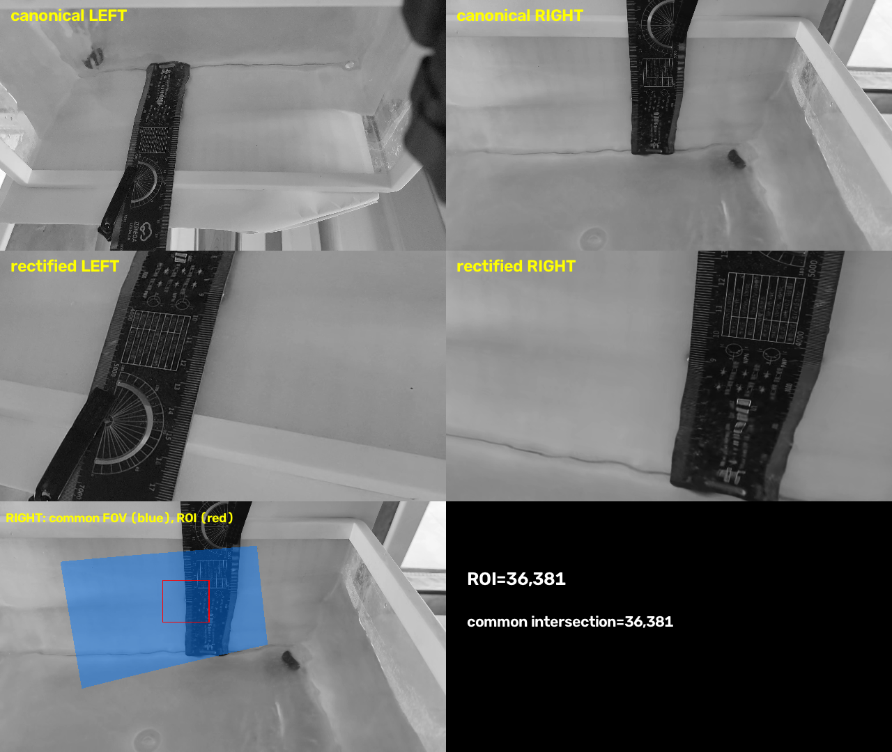
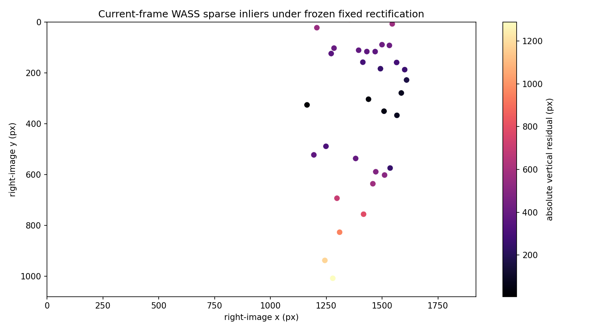
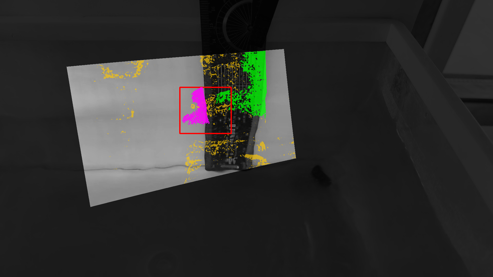
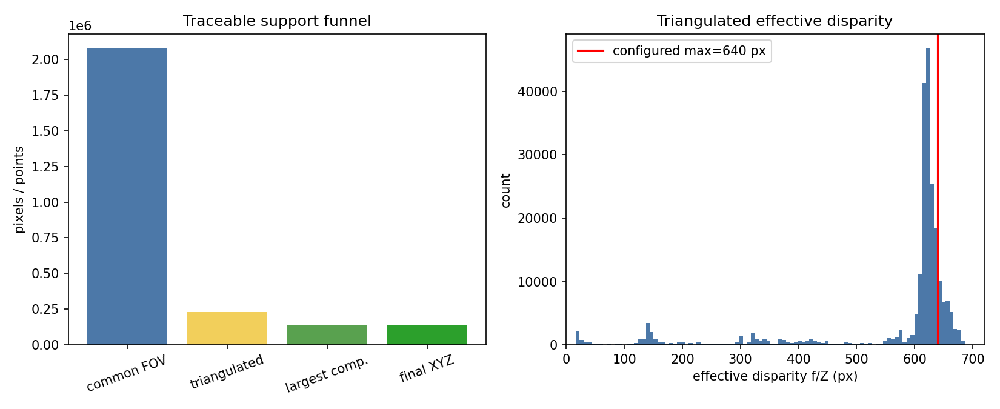
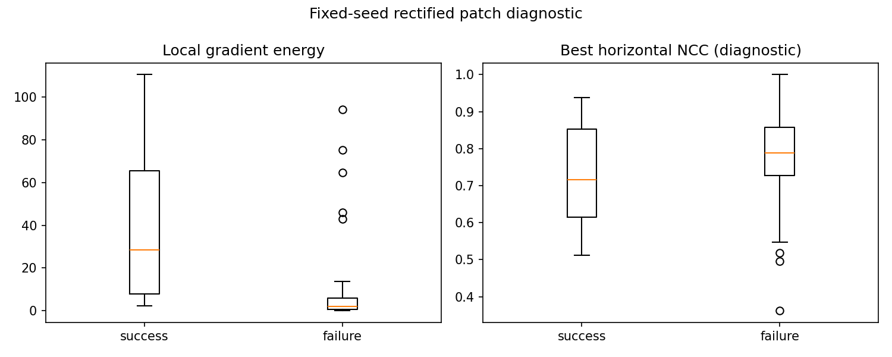

# HomeTank_004 WASS reconstruction-support diagnosis

## Scope and frozen frame

This is a read-only diagnosis of the most recent successful formal random-pause
measurement with complete observability artifacts: `28.8007667 s`, session
`20260831-104155/measurement_28.801s/attempt_+0`. The pair-time error is
`0.6165 ms`. No WASS run was added, no parameter was changed, and ruler data was
not used. The committed GUI ROI contains 36,381 canonical-cam1 pixels.

The observability evidence is the frozen WASS log, `precluster_depth.bin`,
`component_labels.bin`, `component_sizes.csv`, `zgap_threshold.txt`, final
pixel–XYZ correspondence, fixed calibration, and fixed rectification mapping.
No convex hull is called observed support.

## Common field of view

The common mask was derived from the frozen OpenCV `K/D/R/T` and the actual
`alpha=0`, zero-disparity rectification maps. It was not drawn by hand. All
36,381 ROI pixels map into the common rectified field, so the intersection is
36,381 pixels (100%). Alpha-zero rectification makes the full 1920×1080 output
valid in this policy; the independently frozen calibration reports the nearly
identical common ROI `[0,0,1920,1079]` (99.9074%). Common FOV is therefore not
the cause of the small support in this ROI.

## Fixed-rectification alignment

The calibration observations already establish vertical residual median
10.995 px, RMS 21.123 px, P95 46.281 px, and max 92.526 px. For a current-frame
spatial check, the 37 frozen `matches_epionly` correspondences were mapped
through the unchanged fixed calibration using OpenCV `stereoRectify` and
`undistortPoints`. Their absolute vertical residual is median 403.181 px, RMS
579.505 px, P95 1030.120 px, max 1288.535 px and is spatially nonuniform.

The current-frame values must be interpreted cautiously: the sparse matches
are WASS feature inliers under its independently estimated sparse epipolar
model, not an independent target, and the repeated ruler can create ambiguous
features. They are therefore corroborating evidence, not a replacement for the
calibration-observation QA. Both sources reject a claim of accurate global
vertical alignment. Classification:
`RECTIFICATION_SPATIALLY_LIMITING_WASS_SUPPORT`.

## Direct support map and count funnel

The exact committed dense result records 7,181 direct observations inside the
36,381-pixel GUI ROI: 19.738%. Across the full rectified image the pipeline
reports:

| Traceable stage | Count | Relative result |
|---|---:|---:|
| Common rectified FOV | 2,073,600 | 100% |
| Valid triangulated depth | 229,164 | 11.052% of common FOV |
| Largest Z-gap component | 135,205 | 58.999% of triangulated |
| Final XYZ | 135,205 | 6.520% of common FOV |
| After plane crop | 135,205 | no further loss |

The largest absolute and relative loss occurs before valid triangulation: the
dense matching/disparity stage supplies only 11.05% of the common field. Z-gap
component selection then removes another 93,959 points (41.00% of the valid
triangulated population), but plane cropping removes none. Thus the primary
classification is `MATCHING_SUPPORT_LIMITED`; component filtering is a
secondary support contraction, not the first cause.

The support overlay uses dark for outside common FOV, yellow for triangulated
but not retained, green for globally retained pixels, magenta for exact direct
observations in the committed GUI ROI, and red for the ROI boundary.

WASS does not preserve a lossless pre-morphology SGBM valid mask, an LR-check
mask, or per-filter rejection masks in this frozen run. Those stages remain
`INTERMEDIATE_MASK_NOT_AVAILABLE`; the report does not fabricate them.

## Disparity and configured filtering

The traceable pre-cluster depth uses WASS's baseline-normalized rectified camera
depth. With the frozen rectified focal length, the effective disparity
$d=f_{rect}/Z$ has min 16.357 px, P5 145.012 px, median 621.248 px, P95
658.591 px, and max 686.884 px. 76.288% lies at or above 95% of the configured
640-pixel upper bound and 14.974% lies above its nominal integer bound because
the reconstructed effective value includes subpixel/rectification geometry.
There is a real boundary interaction.

However, the prior controlled 1280/2560 range experiment did not recover
support and instead admitted bad/negative-depth matches. Therefore the evidence
still supports `DISPARITY_RANGE_NOT_PRIMARY_LIMIT`, not another range increase.
The actual configuration is `WINSIZE=13`, uniqueness 1, speckle range 16,
speckle window -70, `Disp12MaxDiff=-1`, one dilation, two erosions, and Z-gap
percentile 99. No setting was changed here.

## Minimal appearance diagnostic

Thirty fixed-seed 15×15 patches were sampled from direct-success pixels and 30
from common-FOV ROI pixels with no triangulated depth. On clean reproduced
rectified images, median Sobel gradient energy was 28.382 in the success region
and 2.083 in the failure region. The best same-row horizontal normalized
correlation medians were 0.716 and 0.788 respectively. The apparently high NCC
of failure patches is not unique correspondence evidence: nearly flat patches
can correlate at many offsets. Together with the 13.6× texture-energy gap, this
shows that low-texture/specular water appearance materially limits matching.
Classification: `WATER_APPEARANCE_LIMITING_MATCHING`.

## XYZ extent and ranked causes

The final 135,205 metric points span X `[-0.111368,-0.039037] m`, Y
`[-0.094487,-0.025945] m`, and Z `[0.252190,0.326812] m`, or only about
72.33×68.54×74.62 mm in axis-aligned extent.

| Rank | Factor | Severity | Evidence |
|---:|---|---|---|
| 1 | Water appearance / texture / specularity | HIGH | failure-patch gradient energy is 13.6× lower; valid triangulation covers only 11.05% |
| 2 | Calibration / rectification | HIGH | all frozen QA gates fail; residual is large and spatially nonuniform |
| 3 | Disparity / matcher range | MEDIUM | accepted depth is near 640 px, but prior range expansion did not recover support |
| 4 | Connected-component post-filter | MEDIUM | removes 41.00% after triangulation; plane crop removes zero |
| 5 | Common FOV | LOW | 100% of the selected ROI is in the derived common field |

## Calibration-video salvageability and decision

The existing calibration videos contain 233 cam0 detections, 328 cam1
detections and 192 paired candidates. They are not automatically hopeless.
But the frozen diversity selector retained only 12 independent poses—the exact
minimum—no rejection was possible, spatial edge coverage was not preserved in
the summary, and every accuracy gate failed. The evidence therefore supports
both `EXISTING_CALIBRATION_VIDEO_MAY_BE_SALVAGEABLE` and a conditional
`NEW_CALIBRATION_CAPTURE_RECOMMENDED` if one coverage-aware recalibration of the
existing pairs cannot pass the existing rectification gates.

The next **single action** is to rerun the mature OpenCV calibration on the
existing 192 paired candidates with spatial-coverage-aware pose selection,
requiring board coverage of the actual water-measurement region and accepting
the result only if vertical rectification gates pass. A fresh capture becomes
necessary if that controlled attempt fails. There is no basis for a WASS rerun
or another disparity expansion before this action.

## Direct answers

1. The small support is not caused by the GUI ROI.
2. WASS sees a large common field but valid matching/triangulation fails over
   most of it; it is not simply configured to compute a small rectangle.
3. Recalibration is high priority and is the most actionable geometric route to
   enlarge support, while water texture remains a separate high-severity limit.
4. Merely enlarging disparity/matcher range is not worthwhile given the
   completed controlled tests.
5. Existing calibration footage may permit a better selection, but a major
   support expansion from the already captured water video is not established.
6. The defensible dense route is **more direct WASS observations plus only
   locally validated small-gap completion**, not unbounded model extrapolation.

For the existing HomeTank_004 footage the classification is
`WASS_SUPPORT_EXPANSION_POTENTIAL_LIMITED`. No GUI, reconstruction, WASS,
calibration, synchronization, height definition, MLS, or dense-map behavior was
modified.
